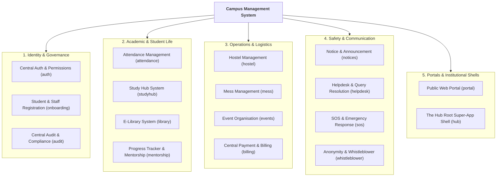
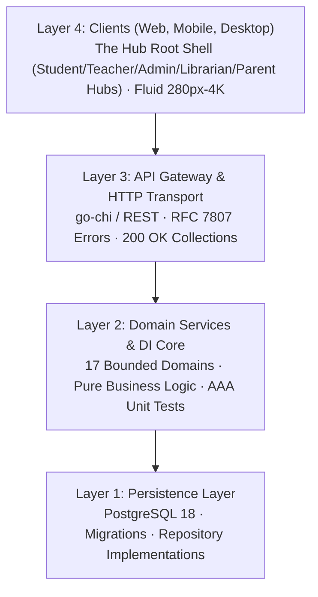

# Campus Management System (CMS)

## Enterprise Modular Monolith for Modern Educational Institutions

[](docs/templates/DOCUMENTATION_STANDARDS.md)
[](#6-license)
[](.agent/rules/ai_anti_patterns.md)

---

## 1. Executive Summary

The **Campus Management System** is a unified, high-performance platform engineered to streamline and automate 17 core campus subsystems—from multi-tenant identity and admissions to mess logistics, emergency SOS response, and compliance reporting.

Built upon strict software engineering standards, the platform adheres to zero-trust multi-tenancy, interface-driven dependency injection, RFC 7807 problem details, and resilient mobile-first design (280px to 4K).

---

## 2. Core Subsystems Catalog



### Subsystems Breakdown

| # | Subsystem | Domain Key | Scope & Key Capabilities |
| :-: | :--- | :--- | :--- |
| **1** | **Public Web Portal** | `portal` | Public landing, programs/courses discovery, campus news, events showcase, prospect lead capture. |
| **2** | **Central Auth & Permissions (IAM)** | `auth` | Multi-tenant RBAC, session token rotation, TOTP MFA, cryptographic constant-time comparisons. |
| **3** | **Mess Management** | `mess` | Daily meal menus, dietary preferences, QR/token meal verification, leave/rebate tracking, vendor billing. |
| **4** | **Hostel Management** | `hostel` | Room/bed inventory, warden approvals, curfew logs, electronic gate passes, maintenance tickets. |
| **5** | **Notice & Announcement** | `notices` | Targeted broadcasts (role/dept/batch/hostel), rich-text notices, priority pinning, push notifications. |
| **6** | **Helpdesk & Query Resolution** | `helpdesk` | Multi-tier ticketing lifecycle, SLA timer tracking, department triage routing, escalation matrices. |
| **7** | **E-Library System** | `library` | Cataloging (ISBN/barcode), physical issue/return/renew, digital media viewer, automated fine engine. |
| **8** | **The Hub (Root Super-App Shell)** | `hub` | Universal institutional root shell containing role-specialized workspaces: Student Hub, Teacher Hub, Admin Hub, Librarian Hub, Parent Hub, Warden Hub. |
| **9** | **Anonymity & Whistleblower** | `whistleblower` | Zero-knowledge encrypted incident reporting (anti-ragging, safety, ethics), 2-way anonymous messaging. |
| **10** | **Attendance Management** | `attendance` | Multi-modal logging (faculty mark, biometric, RFID, geofenced QR), <75% shortage alerts, medical leaves. |
| **11** | **Study Hub System** | `studyhub` | Course syllabus, lecture notes repository, assignments submission & grading, past question papers. |
| **12** | **Event Organisation** | `events` | Institutional events calendar, venue/hall booking approvals, RSVP ticketing, volunteer management. |
| **13** | **Progress Tracker & Mentorship** | `mentorship` | Faculty mentor pairing, early academic risk flags, remediation action plans, 1-on-1 counseling logs. |
| **14** | **SOS & Emergency Response** | `sos` | 1-tap emergency trigger, GPS location broadcast, security dispatcher alerts, broadcast sirens. |
| **15** | **Student & Staff Registration** | `onboarding` | KYC document verification, student roll number generation, employee onboarding, department assignment. |
| **16** | **Central Payment & Billing** | `billing` | Unified invoice generator (tuition, hostel, mess, fines), payment gateways, receipts, installment schedules. |
| **17** | **Central Audit & Compliance** | `audit` | Immutable tamper-evident audit logs, accreditation compliance (NAAC, NIRF, ABET), anomaly detection. |

---

## 3. Architecture & Layering

The system adopts a **Modular Monolith** architecture with four decoupled layers:



### Layer Rules

1. **Frontend Layer:** Communicates exclusively with the API via typed HTTP clients. Powered by **The Hub** root shell architecture.
2. **API Layer:** Handles request deserialization, auth middleware, and RFC 7807 error envelopes. Contains zero domain business logic.
3. **Backend Layer:** Encapsulates domain logic using interface-driven Dependency Injection (DI). Completely decoupled from SQL/database details.
4. **Database Layer:** Implements domain repository interfaces against PostgreSQL.

---

## 4. Quickstart & Lifecycle Orchestration

Following our engineering standards, all repository lifecycle operations are orchestrated via `./script.sh` (Unix) or `.\script.ps1` (Windows):

```bash
# Display help and available commands
./script.sh help

# Install dependencies across all packages
./script.sh deps

# Initialize local environment & database
./script.sh envi

# Run static analysis, typechecking, and linters
./script.sh check

# Execute comprehensive unit and integration test suites
./script.sh test

# Start local development servers
./script.sh dev
```

---

## 5. Engineering Standards & AI Anti-Pattern Guardrails

This project strictly adheres to the authoritative standards defined in [`.agent/rules/`](.agent/rules/):

- **[AI Anti-Pattern Prevention](.agent/rules/ai_anti_patterns.md):** Zero hallucinated commands, zero lazy placeholders (`// TODO`), zero code-doc drift.
- **[Modular Code Construction](.agent/rules/code_construction.md):** Modular block headers (`BLOCK_<DOMAIN>_<ACTION>_<ID>`), flat logic with guard clauses & early returns.
- **[Git Discipline](.agent/rules/git_rules.md):** Conventional commits, single-change atomic commits, GPG/SSH signed commits (`git commit -S`).
- **[Mobile-First Resilience](.agent/rules/mobile_first_responsive.md):** Fluid clamp scaling, container awareness, zero root horizontal overflow, standard top pagination.
- **[API & Error Standards](.agent/rules/api_and_error_handling.md):** RFC 7807 problem details (`application/problem+json`), HTTP 200 OK empty collection query semantics.
- **[Zero-Trust Security & Tenancy](.agent/rules/security_and_tenancy.md):** Explicit tenancy query scoping (`WHERE tenant_id = $1`), sanitized machine keys, constant-time comparisons.
- **[Testing & Dependency Injection](.agent/rules/testing_and_coverage.md):** Co-located tests, mockable interface injection, 100% domain coverage target.

---

## 6. License & Intellectual Property
 
This software and its documentation are proprietary and confidential. All rights reserved. Unauthorized copying, modification, distribution, public display, or decompilation of this repository via any medium is strictly prohibited without prior written authorization.
