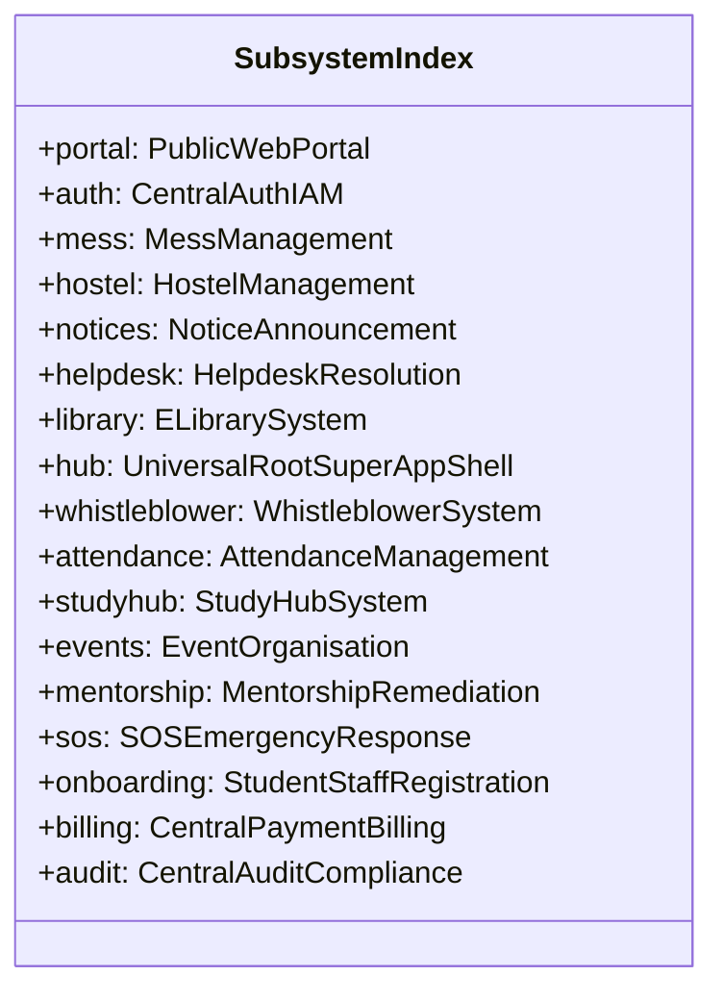

# System Architecture Specification: Campus Management System

**Status:** Authoritative Specification  
**Version:** 1.1.0  
**Scope:** Complete technical blueprint for all 17 campus subsystems, monorepo layering, security invariants, API semantics, and testing contracts.

---

## 1. System Topology & Data Flow

```mermaid
flowchart TD
    subgraph Hub["The Hub: Root Super-App Shell & Workspaces"]
        StudentHub["Student Hub (Courses, Attendance, Mess, Library, SOS)"]
        TeacherHub["Teacher Hub (Roll Call, Grading, Mentorship, Schedules)"]
        AdminHub["Admin Hub (Registrar, IAM, Billing, Compliance)"]
        LibrarianHub["Librarian Hub (Catalog, Circulation, Fines)"]
        ParentHub["Parent Hub (Ward Radar, Approvals, Fee Pay)"]
        WardenHub["Warden Hub (Hostel Allocation, Curfew, Gate Passes)"]
    end

    subgraph Gateway["Layer 3: API Gateway & Network Transport"]
        Router["HTTP Router (go-chi / REST)"]
        AuthMiddleware["Auth & Session Validation Middleware"]
        TenantMiddleware["Multi-Tenant Isolation Scoping"]
        ProblemHandler["RFC 7807 Problem Details Formatter"]
    end

    subgraph Core["Layer 2: Domain Services & Business Logic (DI)"]
        S1["1. Public Web Portal (portal)"]
        S2["2. Central Auth & IAM (auth)"]
        S3["3. Mess Management (mess)"]
        S4["4. Hostel Management (hostel)"]
        S5["5. Notices & Announcements (notices)"]
        S6["6. Helpdesk & Grievances (helpdesk)"]
        S7["7. E-Library System (library)"]
        S8["8. The Hub Root Shell (hub)"]
        S9["9. Anonymity & Whistleblower (whistleblower)"]
        S10["10. Attendance Management (attendance)"]
        S11["11. Study Hub System (studyhub)"]
        S12["12. Event Organisation (events)"]
        S13["13. Mentorship & Remediation (mentorship)"]
        S14["14. SOS & Emergency Response (sos)"]
        S15["15. Registration & Onboarding (onboarding)"]
        S16["16. Payment & Billing (billing)"]
        S17["17. Audit & Compliance (audit)"]
    end

    subgraph Persistence["Layer 1: Persistence & Storage"]
        DB[(PostgreSQL 18 Primary Relational DB)]
        Cache[(Redis Cache & Session Store)]
        Vault[(Zero-Knowledge Encrypted Vault)]
        ObjectStore[(Object Storage / S3 / MinIO Documents)]
    end

    Hub --> Router
    Router --> AuthMiddleware
    AuthMiddleware --> TenantMiddleware
    TenantMiddleware --> Core
    Core --> Persistence
    Router -.-> ProblemHandler
```



---

## 2. The 17 Subsystems Specification



---

### Subsystem 1: Public Web Portal (`portal`)
- **Primary Purpose:** Public gateway for prospective students, campus news, program catalog, and institutional highlights.
- **Key Capabilities:**
  - Dynamic program and degree catalog with curriculum preview.
  - Admissions inquiry capture and lead routing to Onboarding subsystem.
  - Institutional press releases, public announcements, and verified media gallery.
  - Virtual campus tour and facility showcases.
- **Data Invariants:**
  - Read queries for published portal content require no authentication token.
  - Prospect lead submissions are rate-limited (`429 Too Many Requests`) to prevent form spam.
- **API Endpoints:**
  - `GET /api/v1/portal/programs` $\to$ Paginated course listings (`200 OK`).
  - `GET /api/v1/portal/news` $\to$ Published news and press items (`200 OK`).
  - `POST /api/v1/portal/inquiries` $\to$ Create prospective student inquiry (`201 Created`).

---

### Subsystem 2: Central Auth & Permissions System (IAM) (`auth`)
- **Primary Purpose:** Centralized identity provider, multi-tenant RBAC, session rotation, and multi-factor security.
- **Key Capabilities:**
  - Cryptographic token family rotation for refresh tokens (immediate breach invalidation upon replay).
  - Constant-time secret/hash comparison (`subtle.ConstantTimeCompare`).
  - TOTP MFA generation, validation, and emergency backup codes.
  - Hierarchical Role-Based Access Control: `SuperAdmin`, `Admin`, `Faculty`, `Student`, `Parent`, `Staff`, `Auditor`.
- **Data Invariants:**
  - Passwords hashed with Argon2id or bcrypt (cost factor $\ge 12$).
  - Machine keys normalized to lowercase alphanumeric tokens.
- **API Endpoints:**
  - `POST /api/v1/auth/login` $\to$ Authenticate credentials and return token pair.
  - `POST /api/v1/auth/refresh` $\to$ Rotate token family and issue fresh access token.
  - `POST /api/v1/auth/mfa/verify` $\to$ Validate TOTP token.
  - `POST /api/v1/auth/logout` $\to$ Invalidate active session token family (`204 No Content`).

---

### Subsystem 3: Mess Management System (`mess`)
- **Primary Purpose:** Dining hall operations, dietary tracking, meal token verification, and vendor rebate accounting.
- **Key Capabilities:**
  - Daily/weekly rotating menu publication with nutritional and allergen tagging.
  - Dynamic QR code generation & terminal scanner verification for dining hall entry.
  - Mess leave/rebate request workflow (automatic billing rebate calculation on approved leaves $\ge 3$ consecutive days).
  - Special dietary preference declarations (Vegetarian, Non-Vegetarian, Jain, Vegan, Allergen-free).
- **Data Invariants:**
  - A student cannot check into the same meal slot (e.g. Breakfast) more than once per calendar day.
  - Rebate applications must be filed at least 24 hours in advance.
- **API Endpoints:**
  - `GET /api/v1/mess/menu` $\to$ Current weekly dining schedule (`200 OK`).
  - `POST /api/v1/mess/scan` $\to$ Validate dining pass QR token (`200 OK` or `409 Conflict`).
  - `POST /api/v1/mess/rebates` $\to$ Apply for mess rebate (`201 Created`).

---

### Subsystem 4: Hostel Management System (`hostel`)
- **Primary Purpose:** Dormitory room inventory, bed allocation, warden governance, digital gate passes, and room maintenance.
- **Key Capabilities:**
  - Multi-building room matrix and bed allocation engine.
  - Digital Gate Pass application, parent notification, warden approval, and biometric out/in time logging.
  - Hostel curfew attendance tracking and automated absentee alerts.
  - Room change requests and maintenance trouble tickets (Plumbing, Electrical, Furniture).
- **Data Invariants:**
  - Room occupancy cannot exceed defined bed capacity.
  - Overnight gate passes require explicit parent acknowledgement before warden approval.
- **API Endpoints:**
  - `GET /api/v1/hostel/allocations` $\to$ Room and bed occupancy listings (`200 OK`).
  - `POST /api/v1/hostel/gate-passes` $\to$ Submit gate pass request (`201 Created`).
  - `PATCH /api/v1/hostel/gate-passes/{id}/status` $\to$ Approve/Reject gate pass (`200 OK`).

---

### Subsystem 5: Notice & Announcement System (`notices`)
- **Primary Purpose:** Targeted institutional broadcasts, critical urgent alerts, and acknowledgement tracking.
- **Key Capabilities:**
  - Multi-dimensional audience targeting (All Campus, Faculty-only, Department-specific, Batch-specific, Hostel-specific).
  - Priority levels: `CRITICAL` (pinned banner + push/SMS), `IMPORTANT`, `GENERAL`.
  - Expiration lifecycles (auto-archiving past validity window).
  - Mandatory acknowledgement receipts (e.g. anti-ragging undertakings, policy revisions).
- **Data Invariants:**
  - Critical notices appear pinned at the top of all authenticated dashboards until acknowledged or expired.
- **API Endpoints:**
  - `GET /api/v1/notices` $\to$ Paginated notices targeted to active user context (`200 OK`).
  - `POST /api/v1/notices` $\to$ Publish new broadcast notice (`201 Created`).
  - `POST /api/v1/notices/{id}/acknowledge` $\to$ Mark notice as read/acknowledged (`200 OK`).

---

### Subsystem 6: Application & Query Resolution System (Helpdesk) (`helpdesk`)
- **Primary Purpose:** Multi-tier support ticketing, grievance resolution, and SLA timer monitoring.
- **Key Capabilities:**
  - Ticket creation with categorization (Academic, Financial, Hostel, IT Support, General Grievance).
  - Automated SLA tracking with tiered escalation matrices.
  - Private internal staff notes vs. public resolution messages.
  - Student satisfaction CSAT rating upon ticket resolution.
- **Data Invariants:**
  - Closed tickets cannot be edited; reopening requires a transition to `REOPENED` with a mandatory reason.
- **API Endpoints:**
  - `GET /api/v1/helpdesk/tickets` $\to$ Paginated user or department tickets (`200 OK`).
  - `POST /api/v1/helpdesk/tickets` $\to$ Create support ticket (`201 Created`).
  - `PATCH /api/v1/helpdesk/tickets/{id}/status` $\to$ Update lifecycle state (`200 OK`).

---

### Subsystem 7: E-Library System (`library`)
- **Primary Purpose:** Physical catalog management, digital media repository, lending workflows, and automated fine calculation.
- **Key Capabilities:**
  - Physical inventory management with ISBN, Dewey Decimal, and barcode tracking.
  - Issue, return, and renewal state machine with automated overdue fine calculation.
  - Digital repository (e-books, journal articles, research papers) with built-in PDF viewer and access controls.
  - Book reservation queue with automatic availability notifications.
- **Data Invariants:**
  - Students cannot renew books if a pending reservation exists in the queue.
  - Fine accrual stops immediately upon verified physical check-in.
- **API Endpoints:**
  - `GET /api/v1/library/catalog` $\to$ Search physical and digital catalog items (`200 OK`).
  - `POST /api/v1/library/issues` $\to$ Check out physical item (`201 Created`).
  - `POST /api/v1/library/renewals/{id}` $\to$ Renew active loan (`200 OK` or `409 Conflict`).

---

### Subsystem 8: The Hub System (Root Super-App Shell) (`hub`)
- **Primary Purpose:** The institutional **root super-app shell** and workspace orchestrator containing role-specialized hubs.
- **Core Specialized Workspaces Hosted Inside The Hub:**
  1. **Student Hub:** Comprehensive student dashboard (timetables, course materials, attendance radar, mess menu, library checkouts, gate pass requests, SOS).
  2. **Teacher / Faculty Hub:** Roll call register, assignment grading, syllabus milestones, mentee tracking, research repository.
  3. **Admin Hub:** Institution-wide KPI metrics, user management, registrar workflows, financial overview, regulatory audits.
  4. **Librarian Hub:** Desk circulation management, barcode scanning, catalog indexing, fine overrides.
  5. **Parent Hub:** Ward performance radar, attendance percentage alerts, outstanding fee dues, gate pass authorizations.
  6. **Warden Hub:** Hostel occupancy grid, night curfew roll call, gate pass approvals, maintenance oversight.
- **Key Capabilities:**
  - Role-based modular navigation and layout switching.
  - Universal notification drawer and task inbox.
  - Dynamic widget aggregation across all 17 subsystems.
- **Data Invariants:**
  - Workspaces render widgets strictly bounded by the user's verified IAM roles and multi-tenant context.
- **API Endpoints:**
  - `GET /api/v1/hub/workspaces` $\to$ List available hub workspaces for authenticated user (`200 OK`).
  - `GET /api/v1/hub/dashboard` $\to$ Dynamic aggregated dashboard telemetry for active workspace (`200 OK`).

---

### Subsystem 9: Anonymity & Whistleblower System (`whistleblower`)
- **Primary Purpose:** Zero-knowledge encrypted incident reporting for anti-ragging, safety violations, and compliance breaches.
- **Key Capabilities:**
  - Zero-knowledge submission generating a private cryptographic token (claim ticket) for the reporter.
  - Two-way encrypted communication between investigator and anonymous reporter without revealing identity.
  - Anti-retaliation audit logging and oversight committee tracking.
  - Evidence attachment upload with automatic metadata stripping (EXIF data removal).
- **Data Invariants:**
  - No user ID, IP address, or device fingerprint is stored with anonymous incident submissions.
- **API Endpoints:**
  - `POST /api/v1/whistleblower/reports` $\to$ File anonymous report and receive claim token (`201 Created`).
  - `POST /api/v1/whistleblower/inbox` $\to$ Access anonymous thread using claim token (`200 OK`).

---

### Subsystem 10: Attendance Management System (`attendance`)
- **Primary Purpose:** Multi-modal attendance capture, shortage analytics, and regulatory compliance.
- **Key Capabilities:**
  - Multi-source ingestion: Faculty manual roll call, biometric/RFID gate logs, and geofenced dynamic QR sync.
  - Real-time subject-wise percentage calculation with automated $<75\%$ shortage alerts.
  - Medical leave and duty leave reconciliation workflow.
- **Data Invariants:**
  - Attendance entries are timestamped and immutable once locked by the department head.
- **API Endpoints:**
  - `GET /api/v1/attendance/records` $\to$ Query attendance sessions (`200 OK`).
  - `POST /api/v1/attendance/sessions` $\to$ Submit session attendance roster (`201 Created`).
  - `GET /api/v1/attendance/summary` $\to$ Cumulative percentage per subject (`200 OK`).

---

### Subsystem 11: Study Hub System (`studyhub`)
- **Primary Purpose:** Academic resource repository, syllabus tracking, assignment submissions, and past exam archives.
- **Key Capabilities:**
  - Course curriculum and lecture notes distribution.
  - Assignment creation, file submission, deadline enforcement, and rubric-based grading.
  - Searchable repository of previous years' examination question papers.
  - Subject-specific discussion and peer Q&A threads.
- **Data Invariants:**
  - Late submissions are either blocked or flagged as `LATE` with timestamp precision based on course configuration.
- **API Endpoints:**
  - `GET /api/v1/studyhub/courses/{courseId}/materials` $\to$ Downloadable lecture notes (`200 OK`).
  - `POST /api/v1/studyhub/assignments/{id}/submit` $\to$ Upload student submission (`201 Created`).

---

### Subsystem 12: Event Organisation System (`events`)
- **Primary Purpose:** Campus events lifecycle, venue allocation, RSVP ticketing, and volunteer staffing.
- **Key Capabilities:**
  - Institutional master calendar for cultural, technical, and sports events.
  - Campus venue/auditorium booking engine with conflict resolution.
  - Participant registration, ticketing, and check-in QR validation.
  - Automated digital certificate generation for attendees and winners.
- **Data Invariants:**
  - Two events cannot book the same venue during overlapping time intervals (`409 Conflict`).
- **API Endpoints:**
  - `GET /api/v1/events` $\to$ Paginated upcoming events (`200 OK`).
  - `POST /api/v1/events` $\to$ Create event and reserve venue (`201 Created`).
  - `POST /api/v1/events/{id}/rsvp` $\to$ Register for event (`200 OK`).

---

### Subsystem 13: Progress Tracker & Resolution System (Mentorship) (`mentorship`)
- **Primary Purpose:** Academic mentorship, early warning detection, remediation plans, and counseling.
- **Key Capabilities:**
  - Automated detection of at-risk students (low attendance + declining test scores).
  - Faculty mentor assignment and 1-on-1 counseling log tracking.
  - Remedial action plans with milestone check-ins.
- **Data Invariants:**
  - Counseling notes can be marked `CONFIDENTIAL` to restrict visibility strictly to the mentor and head counselor.
- **API Endpoints:**
  - `GET /api/v1/mentorship/mentees` $\to$ List assigned students and risk flags (`200 OK`).
  - `POST /api/v1/mentorship/sessions` $\to$ Record counseling session log (`201 Created`).

---

### Subsystem 14: SOS & Emergency Response System (`sos`)
- **Primary Purpose:** Rapid emergency response, student safety triggers, and security dispatch coordination.
- **Key Capabilities:**
  - One-tap mobile SOS trigger transmitting real-time GPS coordinates to campus security dispatchers.
  - Mass campus emergency broadcast siren via push notification, SMS, and email.
  - Incident dispatch assignment and timeline audit tracking.
- **Data Invariants:**
  - SOS alerts trigger instant high-priority notifications bypassing all user mute/do-not-disturb preferences.
- **API Endpoints:**
  - `POST /api/v1/sos/trigger` $\to$ Emit emergency SOS event with GPS telemetry (`201 Created`).
  - `PATCH /api/v1/sos/{id}/resolve` $\to$ Resolve emergency with post-mortem report (`200 OK`).

---

### Subsystem 15: Student & Staff Registration System (Onboarding) (`onboarding`)
- **Primary Purpose:** Identity verification, applicant KYC, document management, and institutional onboarding.
- **Key Capabilities:**
  - Student admissions onboarding: KYC document verification, roll number generation, section allocation.
  - Staff onboarding: Employee profile creation, qualification verification, department assignment.
  - Profile lifecycle management and ID card data generation.
- **Data Invariants:**
  - Roll numbers and Employee IDs must remain strictly unique across the institution.
- **API Endpoints:**
  - `POST /api/v1/onboarding/students` $\to$ Register verified student (`201 Created`).
  - `POST /api/v1/onboarding/staff` $\to$ Register verified employee (`201 Created`).

---

### Subsystem 16: Central Payment & Billing System (`billing`)
- **Primary Purpose:** Unified tuition, hostel, mess, and fine invoice generation, payment processing, and ledger reconciliations.
- **Key Capabilities:**
  - Consolidated student invoice generation across all campus subsystems.
  - Payment gateway webhooks (Stripe, Razorpay, UPI) with cryptographic signature validation.
  - Installment plan scheduling and partial payment tracking.
  - Automated downloadable tax receipts.
- **Data Invariants:**
  - Double-entry accounting invariants: every transaction must balance (`debits == credits`).
- **API Endpoints:**
  - `GET /api/v1/billing/invoices` $\to$ Paginated student invoices (`200 OK`).
  - `POST /api/v1/billing/checkout` $\to$ Initiate payment gateway checkout session (`200 OK`).
  - `POST /api/v1/billing/webhooks` $\to$ Ingest gateway payment webhook (`200 OK`).

---

### Subsystem 17: Central Audit & Compliance System (`audit`)
- **Primary Purpose:** Immutable audit trail, regulatory reporting (NAAC, NIRF, ABET), and anomalous activity monitoring.
- **Key Capabilities:**
  - Tamper-evident structured audit logging across all subsystems (Actor, Action, Resource, IP, Timestamp, Diff).
  - Accreditation compliance report generator (student-faculty ratio, pass percentages, infrastructure stats).
  - Suspicious activity alerts (e.g. bulk grade modification, off-hours gate pass overrides).
- **Data Invariants:**
  - Audit logs are append-only; update and delete operations are strictly forbidden at the database level.
- **API Endpoints:**
  - `GET /api/v1/audit/logs` $\to$ Paginated audit trail with filtering (`200 OK`).
  - `GET /api/v1/audit/compliance/naac` $\to$ Export NAAC data matrix (`200 OK`).

---

## 3. Cross-Cutting RBAC & Permissions Matrix

| Subsystem | SuperAdmin | Admin | Faculty | Student | Parent | Staff | Auditor |
| :--- | :---: | :---: | :---: | :---: | :---: | :---: | :---: |
| **1. Portal** | Manage | Manage | View | View | View | View | View |
| **2. Auth & IAM** | Full Control | User Admin | Self | Self | Self | Self | Audit Only |
| **3. Mess** | Manage | Manage | View | Order/Rebate | View Ward | Verify QR | Audit Only |
| **4. Hostel** | Manage | Warden Admin | View | Request/Pass | Approve Ward | Guard Log | Audit Only |
| **5. Notices** | Publish | Publish | Dept Publish | View | View | View | Audit Only |
| **6. Helpdesk** | Manage | Resolve All | Resolve Dept | Create/View | Create Ward | Resolve Task | Audit Only |
| **7. Library** | Manage | Issue/Catalog | Borrow/Read | Borrow/Read | View Fines | Issue/Return | Audit Only |
| **8. The Hub Root** | Admin Hub | Admin Hub | Teacher Hub | Student Hub | Parent Hub | Staff/Warden Hub | Auditor Hub |
| **9. Whistleblower** | Supervise | Investigate | File Anon | File Anon | File Anon | File Anon | Oversight |
| **10. Attendance** | Manage | Manage | Mark/Edit | View Self | View Ward | Kiosk Ingest | Audit Only |
| **11. Study Hub** | Manage | Manage | Author/Grade | Submit/Read | View Progress | — | Audit Only |
| **12. Events** | Manage | Approve | Host/RSVP | RSVP/Attend | View | Coordinate | Audit Only |
| **13. Mentorship** | Manage | Manage | Mentor | Mentee | View Logs | — | Audit Only |
| **14. SOS** | Global Alerts | Dispatch | Alert/Track | Alert/Track | Ward Alerts | Security Resp | Audit Only |
| **15. Onboarding** | Full Control | Registrar | Dept View | Self Profile | Ward Profile | Self Profile | Audit Only |
| **16. Billing** | Full Control | Finance Admin | View Payslip | Pay Invoices | Pay Ward Fees | View Payslip | Compliance |
| **17. Audit** | Full Control | View Dept | — | — | — | — | Full Read |

---

## 4. REST API Semantics & RFC 7807 Error Catalog

All endpoints conform to:
1. Versioning prefix: `/api/v1/<domain>/...`
2. Collection Queries: Always return `200 OK` with `{"data": [], "pagination": ...}` when query is valid but no items exist.
3. Errors: Always return `application/problem+json`:

```json
{
  "type": "https://campus.institution.edu/errors/INSUFFICIENT_ATTENDANCE",
  "title": "Exam Registration Ineligible",
  "status": 422,
  "detail": "Student attendance in CS-301 is 68.4%, below the mandatory 75% threshold.",
  "instance": "/api/v1/academics/exams/register",
  "code": "INSUFFICIENT_ATTENDANCE",
  "invalid_params": [
    {
      "name": "course_id",
      "reason": "Attendance below minimum threshold"
    }
  ]
}
```

---

## 5. Mobile-First & Viewport Resilience Architecture

- All layouts are fluid from 280px (narrow phones) to 4K displays.
- Root horizontal scrolling (`scrollWidth > innerWidth`) is strictly forbidden.
- Collections display standardized **Top Pagination Headers** positioned above data grids to eliminate dynamic layout shift.
- Wide tabular grids adapt on mobile (`< 768px`) into dedicated touch entity cards with 44px minimum touch targets.

---

## 6. Dependency Injection & Testing Invariants

Every domain subsystem exposes mockable interfaces for all persistence and external side-effects:

```go
// Example: Hostel Subsystem DI Interface
package hostel

type Repository interface {
    GetAllocationByBedID(ctx context.Context, bedID string) (*Allocation, error)
    CreateGatePass(ctx context.Context, pass *GatePass) error
    UpdateGatePassStatus(ctx context.Context, passID string, status GatePassStatus) error
}

type Service struct {
    repo Repository
}

func NewService(repo Repository) *Service {
    return &Service{repo: repo}
}
```

Unit tests execute in milliseconds using in-memory mock repositories, guaranteeing 100% domain coverage and zero test flakiness.
