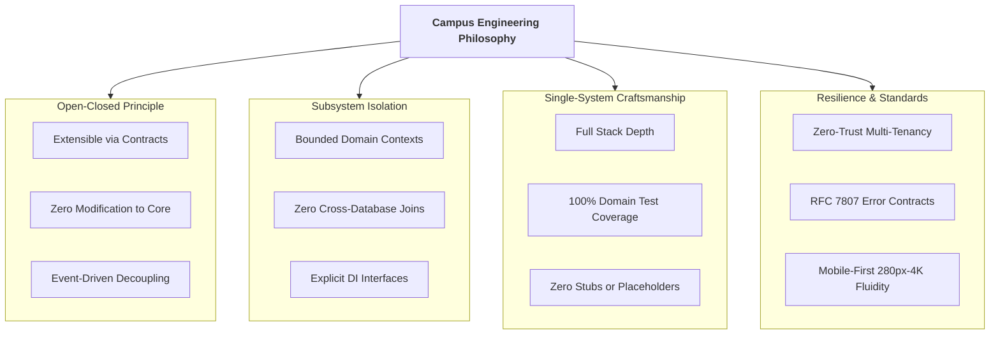
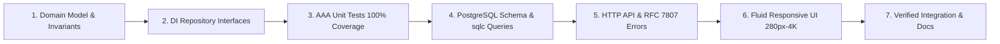

# Campus Engineering Philosophy & Architectural Invariants

**Document Version:** 1.0.0  
**Status:** Authoritative Standard (Non-Negotiable)  
**Scope:** Design principles, Open-Closed invariants, single-subsystem craftsmanship methodology, and dependency contracts.

---

## 1. Core Architectural Tenets

---

## 2. The Open-Closed Principle (OCP) Invariant

> **"Software entities (classes, modules, functions, subsystems) should be open for extension, but closed for modification."**

To ensure any feature can be added or removed in the future without touching existing subsystem code:

1. **Strict Bounded Contexts:**
   - Each of the 17 subsystems is a self-contained module within `backend/<domain>/`.
   - Subsystem internal structs, state machines, and private validation routines are private to that subsystem.
2. **Zero Cross-Subsystem Database Joins:**
   - Subsystems must never query or mutate another subsystem's database tables directly.
   - If Subsystem A (e.g. `hostel`) needs data from Subsystem B (e.g. `billing`), it consumes Subsystem B through a declared Go/TypeScript interface or domain event.
3. **Interface Contracts & Event Emission:**
   - Subsystems publish typed domain events (e.g., `EventStudentEnrolled`, `EventFineIncurred`, `EventAttendanceShortageAlerted`) via an internal event bus.
   - Subsystems hook into other subsystems as event subscribers. Adding a new feature means adding a new subscriber or adapter without modifying existing domain service code.
4. **Pluggable Feature Flags & Extensibility Hooks:**
   - Every subsystem accepts optional middleware pipelines, hooks, and strategy providers injected at initialization time.

---

## 3. The Single-Subsystem Craftsmanship Protocol

We do not build horizontal slices across all systems simultaneously. We build **one subsystem at a time**, from foundational dependency rank 1 to rank 17, taking each to 100% production readiness before moving to the next.

### Definition of Done for Each Subsystem:

1. **Domain Logic & Invariants:** Pure Go/TypeScript business rules, state machines, and error models.
2. **Dependency Injection Contracts:** Repository, Cache, and Event interfaces defined.
3. **100% Unit Test Coverage:** Deterministic AAA tests executing in milliseconds with mock implementations.
4. **PostgreSQL Schema & Queries:** Explicit migration scripts, indexes, foreign keys, and typed SQL queries.
5. **REST API & RFC 7807 Handling:** HTTP handlers, route registration, middleware, and `200 OK` empty collection query semantics.
6. **Mobile-First Responsive Interface:** Viewport-resilient UI with dedicated mobile entity cards, zero horizontal scroll, and top pagination.
7. **Documentation & Traceability:** Synchronized domain docs with modular block IDs (`BLOCK_<DOMAIN>_<ACTION>_<ID>`).

---

## 4. Code Construction & Guard Clause Standards

- **Modular Block Headers:** Every major logical block must start with a descriptive header detailing inputs, outputs, errors, and its unique Block ID.
- **Flat Logic with Guard Clauses:** Deeply nested `if/else` ladders are strictly prohibited. Guard against invalid inputs early and keep the happy path unindented.
- **Explicit Typing:** Zero `any` or untyped data bags. All domain mutations pass strictly typed command and query objects.
- **Constant-Time Security Comparisons:** All hash and token verifications use constant-time algorithms.
