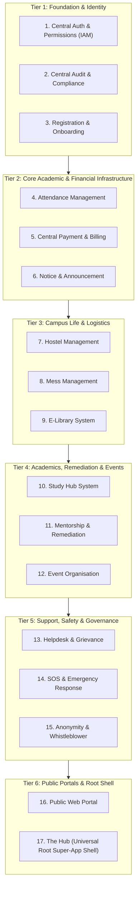

# Subsystem Ranking & Execution Roadmap

**Document Version:** 1.1.0  
**Status:** Authoritative Sequential Plan  
**Strategy:** Strict Topological Dependency Order (Rank 1 $\to$ Rank 17)

---

## 1. Topological Dependency Hierarchy

---

## 2. Definitive Subsystem Ranking Matrix

| Rank | Subsystem | Domain Key | Dependency Rationale & Why It Is Ordered Here |
| :-: | :--- | :--- | :--- |
| **1** | **Central Auth & Permissions (IAM)** | `auth` | **Absolute Foundation.** Provides tokens, cryptographic identity, multi-tenant RBAC, and session security. Every other subsystem touches auth. |
| **2** | **Central Audit & Compliance** | `audit` | **Immutable Ledger.** Every mutation across all subsequent subsystems must log structured audit trails from day one. |
| **3** | **Student & Staff Registration (Onboarding)** | `onboarding` | **Entity Master Registry.** Establishes verified student roll numbers, staff profiles, employee IDs, departments, and batch cohorts. |
| **4** | **Attendance Management** | `attendance` | **Academic Invariant Engine.** Tracks daily attendance; feeds prerequisites for exams, hostel curfews, and mentorship alerts. |
| **5** | **Central Payment & Billing** | `billing` | **Universal Financial Engine.** Invoices, ledgers, and payment gateways consumed by hostel, mess, library, and tuition. |
| **6** | **Notice & Announcement** | `notices` | **Central Broadcast Engine.** Alerting backbone used by administration, departments, hostel wardens, and emergency systems. |
| **7** | **Hostel Management** | `hostel` | **Living Operations.** Bed allocation, warden workflows, curfew tracking, and gate passes. Emits leave events for mess rebates and invoices to billing. |
| **8** | **Mess Management** | `mess` | **Dining Logistics.** Daily meal schedules, QR entry validation, and leave rebate accounting linked to hostel leaves. |
| **9** | **E-Library System** | `library` | **Resource Circulation.** Book cataloging, issue/return state machines, and overdue fine generation linked to billing. |
| **10** | **Study Hub System** | `studyhub` | **Coursework & Notes.** Syllabus repository, assignment submission/grading, past exam question archive. |
| **11** | **Progress Tracker & Mentorship** | `mentorship` | **Student Success Engine.** Synthesizes low attendance (from Rank 4) and coursework metrics (from Rank 10) to guide remediation plans. |
| **12** | **Event Organisation** | `events` | **Institutional Calendar.** Venue booking conflict checks, RSVP ticketing, volunteer staffing, certificates. |
| **13** | **Helpdesk & Query Resolution** | `helpdesk` | **Support & Grievances.** Tiered ticket lifecycles, SLA timers, and department routing across all campus domains. |
| **14** | **SOS & Emergency Response** | `sos` | **Crisis Response.** Instant mobile 1-tap SOS trigger, real-time GPS broadcast, security dispatch, and sirens. |
| **15** | **Anonymity & Whistleblower** | `whistleblower` | **Zero-Knowledge Safety.** Anti-ragging and compliance reporting with cryptographic anonymous 2-way messaging. |
| **16** | **Public Web Portal** | `portal` | **External Showcase.** Public program discovery, campus news, event feeds (from Rank 12), prospect lead capture (to Rank 3). |
| **17** | **The Hub (Universal Root Super-App Shell)** | `hub` | **Institutional Root Host.** The overarching super-app shell uniting Student Hub, Teacher Hub, Admin Hub, Librarian Hub, Parent Hub, and Warden Hub. |

---

## 3. Single-System Execution Protocol

For each rank $N \in [1..17]$, the following 7-step sequence is executed to completion:

1. **Step 1: Domain Core & Data Contracts** (`backend/<domain>/domain.go`, `types.go`, `errors.go`).
2. **Step 2: Repository & Event Interfaces (DI)** (`backend/<domain>/repository.go`, `events.go`).
3. **Step 3: Domain Service & 100% Mock Unit Tests** (`backend/<domain>/service.go`, `service_test.go`).
4. **Step 4: PostgreSQL Schema Migration & Queries** (`database/migrations/`, `database/postgres/`).
5. **Step 5: API Handlers, Router & RFC 7807 Error Mappings** (`api/http/<domain>/handler.go`, `router.go`).
6. **Step 6: Viewport-Resilient UI Components** (`frontend/web/`, `frontend/mobile/`).
7. **Step 7: Verification & Documentation Lock** (`docs/<domain>.md`, test suite pass gate).

---

## 4. First Objective: Rank 1 — Central Auth & Permissions (IAM)

We begin immediately with **Rank 1 (`auth`)**:
- Token Family Session Rotation (Anti-token reuse breach detection).
- Constant-time secret verification.
- Argon2id password hashing.
- TOTP MFA provider.
- RBAC permissions matrix and middleware.
- Full DI test suite with 100% domain coverage.
