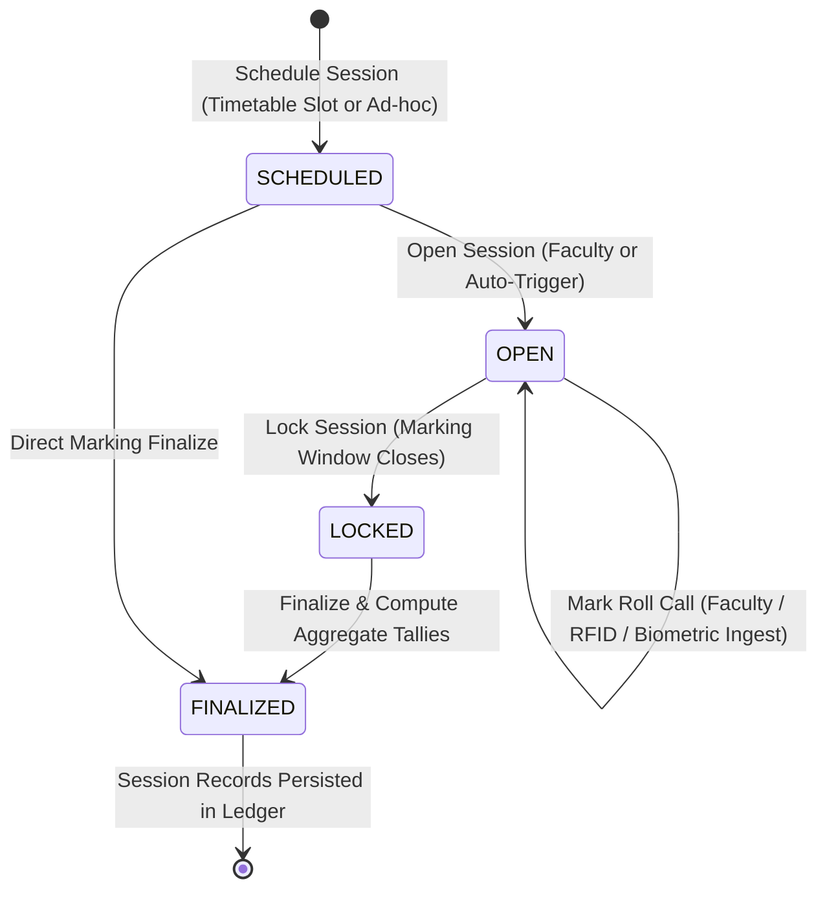
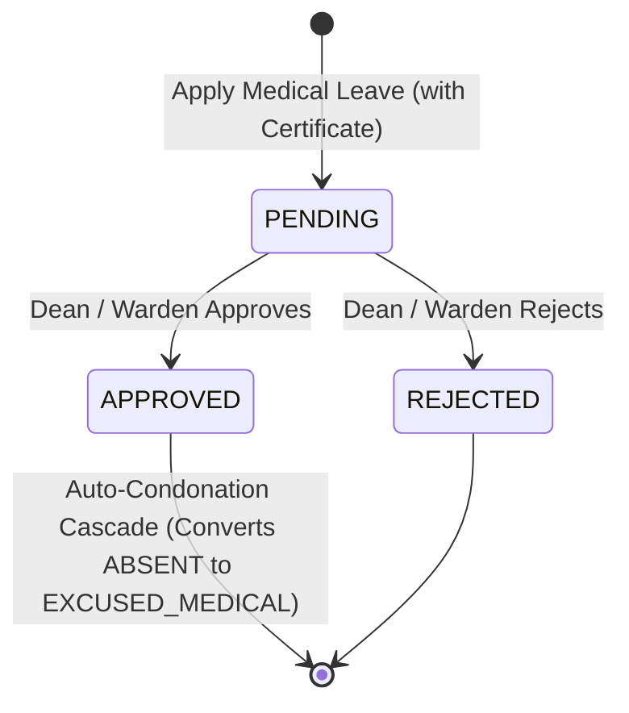

# Subsystem Specification: Attendance Management System (Attendance)

**Subsystem Key:** `attendance`  
**Rank:** 4 of 17 (Topological Pre-requisite for Examination Eligibility, Housing Curfew, and Mentorship Analytics)  
**Status:** Implemented & Verified (100% Mock Unit & HTTP Integration Tests Passing)  

---

## 1. Domain Architecture & Lifecycle State Machine

---

## 2. Invariants & Business Rules

1. **Multi-Mode Roll Call Ingestion:**
   - Supports 4 modes: `MANUAL_FACULTY`, `BIOMETRIC_TERMINAL`, `RFID_SCAN`, `GEOFENCE_MOBILE`.
   - Records capture student ID, status (`PRESENT`, `ABSENT`, `LATE`, `EXCUSED_MEDICAL`), timestamp, device identifier, and optional geolocation coords.
2. **Deterministic Attendance Shortage Calculation:**
   - Formula:
     $$\text{Attendance Percentage} = \frac{\text{Present Sessions} + \text{Excused Medical Sessions}}{\text{Total Conducted Sessions}} \times 100$$
   - Invariant: If $\text{Percentage} < 75.0\%$, the student is automatically flagged with `is_shortage: true`, preventing examination admit card issuance.
3. **Medical Leave Condonation Cascade:**
   - When a `MedicalLeaveApplication` is approved for a date window (`fromDate` to `toDate`), the service automatically converts all historical absence records in that window into `EXCUSED_MEDICAL`.
   - The student's effective attendance percentage is immediately recalculated and restored without manual record patching.
4. **Audit Trail Integration:**
   - Emits structured domain events (`attendance:session:scheduled`, `attendance:session:opened`, `attendance:session:marked`, `attendance:session:locked`, `attendance:session:finalized`, `attendance:medical_leave:applied`, `attendance:medical_leave:decision`) to the Rank 2 immutable audit ledger.

---

## 3. Implemented Components & File Mapping

| Layer | Component | Path | Invariant / Purpose |
| :--- | :--- | :--- | :--- |
| **Database** | Prisma Relational Schema | `database/schema.prisma` | Models for `CourseSubject`, `TimetableSlot`, `AttendanceSession`, `AttendanceRecord`, `MedicalLeaveApplication`. |
| **Domain** | Domain Core & State Machine | `backend/attendance/domain.go` | Aggregate models, session state machine (`SCHEDULED` $\to$ `OPEN` $\to$ `LOCKED` $\to$ `FINALIZED`), and shortage calculator ($<75\%$). |
| **Domain** | Error Catalog | `backend/attendance/errors.go` | Domain error sentinels mapped to RFC 7807 problem details. |
| **Domain** | Repository Contracts | `backend/attendance/repository.go` | Interface contracts for catalog, session, record, and medical leave repositories. |
| **Domain** | Business Service | `backend/attendance/service.go` | Roll call marking, biometric sync, session locking, shortage computation, and medical leave cascade. |
| **Domain** | In-Memory Mock Repository | `backend/attendance/mock_repository.go` | Thread-safe in-memory test doubles. |
| **Domain** | Unit Test Suite | `backend/attendance/attendance_test.go` | 7 exhaustive unit tests covering roll call, biometric ingestion, shortage calculation, and medical condonation. |
| **API** | HTTP Transport Handlers | `api/http/attendance/handler.go` | REST handlers with RFC 7807 problem details, pagination, and query filtering. |
| **API** | HTTP Transport Tests | `api/http/attendance/handler_test.go` | REST integration tests for subjects, sessions, roll call, summary, and medical leave decisions. |
| **Web Frontend** | TypeScript Types | `frontend/web/src/lib/types/attendance.ts` | Frontend domain interfaces for subjects, slots, sessions, records, and summaries. |
| **Web Frontend** | Attendance Roster Component | `frontend/web/src/lib/components/attendance/AttendanceRoster.svelte` | Interactive multi-mode roll call roster with live status toggling and tallies. |
| **Web Frontend** | Shortage Monitor Component | `frontend/web/src/lib/components/attendance/AttendanceShortageTable.svelte` | Cohort shortage monitor flagging attendance rate $<75\%$ and leave actions. |
| **Web Frontend** | Attendance Route Page | `frontend/web/src/routes/attendance/+page.svelte` | Faculty and admin attendance dashboard. |
| **Mobile Frontend** | Mobile Attendance Screen | `frontend/mobile/app/(app)/attendance.tsx` | Mobile attendance summary, subject breakdown, and medical leave filing. |

---

## 4. REST API Endpoint Catalog

| HTTP Method | Route | Description | Success Code |
| :--- | :--- | :--- | :--- |
| `POST` | `/api/v1/attendance/subjects` | Create course subject | `201 Created` |
| `POST` | `/api/v1/attendance/slots` | Create timetable slot | `201 Created` |
| `POST` | `/api/v1/attendance/sessions` | Schedule attendance session | `201 Created` |
| `GET` | `/api/v1/attendance/sessions` | List sessions with query filters | `200 OK` |
| `GET` | `/api/v1/attendance/sessions/{id}` | Get session details & roster records | `200 OK` |
| `POST` | `/api/v1/attendance/sessions/{id}/open` | Open session for roll call | `200 OK` |
| `POST` | `/api/v1/attendance/sessions/{id}/mark` | Batch mark roll call records | `200 OK` |
| `POST` | `/api/v1/attendance/sessions/{id}/biometric` | Ingest biometric device check-ins | `200 OK` |
| `POST` | `/api/v1/attendance/sessions/{id}/lock` | Lock session from further modifications | `200 OK` |
| `POST` | `/api/v1/attendance/sessions/{id}/finalize` | Finalize session and compute totals | `200 OK` |
| `GET` | `/api/v1/attendance/summary/students/{student_id}` | Get student attendance % and shortage status | `200 OK` |
| `POST` | `/api/v1/attendance/leaves` | Apply for medical leave condonation | `201 Created` |
| `POST` | `/api/v1/attendance/leaves/{id}/decision` | Approve / reject medical leave (triggers cascade) | `200 OK` |
