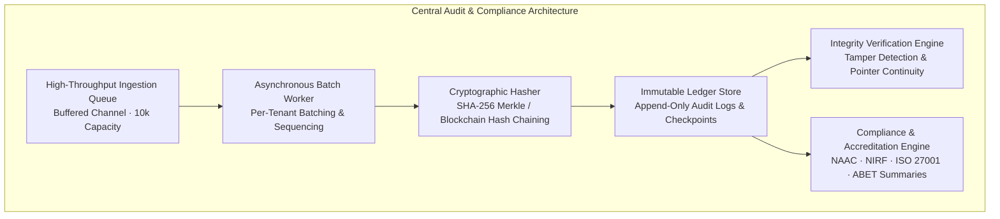

# Subsystem Specification: Central Audit & Compliance System

**Subsystem Key:** `audit`  
**Rank:** 2 of 17 (Topological Foundation)  
**Status:** Implemented & Verified (100% Mock Unit & HTTP Tests Passing)  

---

## 1. Domain Architecture & Capabilities

---

## 2. Security & Compliance Invariants

1. **Cryptographic SHA-256 Hash Chaining:**
   - Every audit log entry $R_i$ contains a SHA-256 hash calculated over its payload fields and the hash of the preceding record $R_{i-1}$ (`prev_hash`).
   - Tenant chains are strictly segregated: each tenant maintains an independent hash chain beginning from a canonical genesis salt.
2. **Deterministic Tamper Detection:**
   - If any past record in the database is modified, deleted, or inserted out of order, calling `VerifyChainIntegrity` fails immediately, pinpoints the corrupted record ID and index, and reports the exact mismatch.
3. **High-Throughput Asynchronous Ingestion:**
   - Non-blocking buffered event ingestion (queue capacity 10,000) guarantees zero latency penalty on business transactions while handling up to 5,000 peak concurrent active sessions.
   - Background worker processes batches and flushes periodically (50ms interval) or on batch saturation (100 items), with clean draining on server shutdown.
4. **Accreditation & Compliance Reporting:**
   - Dedicated compliance engine produces formal analytics for accreditation bodies (NAAC Criterion 6, NIRF, ISO/IEC 27001, ABET) aggregating total events, success rates, security incidents (lockouts, token breach detections), and top actors.

---

## 3. Implemented Components & File Mapping

| Layer | Component | Path | Invariant / Purpose |
| :--- | :--- | :--- | :--- |
| **Database** | Prisma Relational Schema | `database/schema.prisma` | PostgreSQL 18 `AuditLog` and `AuditVerificationCheckpoint` models. |
| **Domain** | Domain Entities & Schemas | `backend/audit/domain.go` | Core models, filter criteria, verification results, compliance schemas. |
| **Domain** | Error Catalog | `backend/audit/errors.go` | Domain errors mapped to RFC 7807 problem details. |
| **Domain** | Cryptographic Hasher | `backend/audit/hasher.go` | SHA-256 deterministic hash chaining and verification engine. |
| **Domain** | Repository Contract | `backend/audit/repository.go` | Data access interface for immutable audit ledger and checkpoints. |
| **Domain** | Async Subscriber | `backend/audit/subscriber.go` | High-performance buffered queue and batch worker. |
| **Domain** | Domain Service | `backend/audit/service.go` | Service orchestrating logging, querying, verification, and compliance. |
| **Testing** | Domain Test Suite | `backend/audit/service_test.go` | 10 exhaustive unit tests (81.4% coverage). |
| **Testing** | In-Memory Doubles | `backend/audit/mock.go` | Thread-safe mock repository with simulated tampering hooks. |
| **API** | HTTP Handlers | `api/http/audit/handler.go` | Versioned REST endpoints with RFC 7807 error responses and pagination. |
| **API** | HTTP Router | `api/http/audit/router.go` | Chi router registration for `/api/v1/audit/*`. |
| **API** | HTTP Test Suite | `api/http/audit/handler_test.go` | 5 HTTP transport integration contract tests. |
| **Frontend** | Svelte 5 Audit Table | `frontend/web/src/lib/components/audit/AuditLogTable.svelte` | Interactive data table with inspect dialog & chain verification. |
| **Frontend** | Svelte 5 Compliance Dashboard | `frontend/web/src/lib/components/audit/ComplianceReportView.svelte` | Accreditation KPI cards & framework reporting view. |
| **Frontend** | Mobile Audit List | `frontend/mobile/src/components/audit/AuditLogList.tsx` | React Native mobile audit trail viewer with chain status banner. |

---

## 4. API Endpoints Reference

| Method | Route | Description | Invariants |
| :--- | :--- | :--- | :--- |
| `GET` | `/api/v1/audit/logs` | Query paginated audit trails with multi-field filters | `X-Total-Count` header, RFC 7807 errors |
| `GET` | `/api/v1/audit/logs/{id}` | Retrieve single audit log with full metadata & changes diff | 404 Problem Details if not found |
| `POST` | `/api/v1/audit/verify` | Verify cryptographic SHA-256 hash chain integrity over time range | Returns `VerificationResult` with tamper diagnosis |
| `POST` | `/api/v1/audit/checkpoints` | Generate an immutable verification anchor checkpoint | Returns 201 Created with checkpoint snapshot |
| `GET` | `/api/v1/audit/compliance-reports` | Generate compliance report for accreditation (NAAC / NIRF / ISO 27001) | Aggregates volume, security incidents, top actors |
