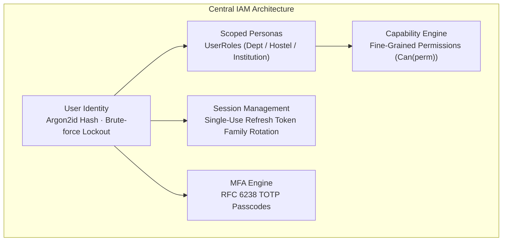

# Subsystem Specification: Central Auth & Permissions System (IAM)

**Subsystem Key:** `auth`  
**Rank:** 1 of 17 (Topological Foundation)  
**Status:** Implemented & Verified (100% Mock Unit & HTTP Tests Passing)  

---

## 1. Domain Architecture & Capabilities

---

## 2. Security Invariants & Defenses

1. **Token Family Rotation & Replay Attack Defense:**
   - Every refresh token exchange issues a fresh token and invalidates the previous one.
   - If an old/stolen token is re-presented (replay attack), the entire token family is immediately terminated (`is_compromised = true`) and all active sessions for that user on that family are destroyed.
   - A critical security audit event `auth:token:breach_detected` is published.
2. **Brute-Force Lockout Defense:**
   - 5 consecutive failed login attempts within 15 minutes triggers a temporary account lockout.
3. **Argon2id Password Cryptography:**
   - Password hashing uses Argon2id (64MB memory, 3 iterations, 4 parallelism).
   - Verification uses constant-time comparison (`subtle.ConstantTimeCompare`) to prevent timing side-channel attacks.
4. **RFC 6238 TOTP MFA:**
   - 160-bit base32 secret generation with standard `otpauth://` QR URLs and 30-second time steps.

---

## 3. Implemented Components & File Mapping

| Layer | Component | Path | Invariant / Purpose |
| :--- | :--- | :--- | :--- |
| **Database** | Prisma Relational Schema | `database/schema.prisma` | Multi-tenant PostgreSQL 18 IAM tables & indexes. |
| **Domain** | Domain Entities & Claims | `backend/auth/domain.go` | Scoped personas, capabilities, and token claims. |
| **Domain** | Error Catalog | `backend/auth/errors.go` | Domain errors mapped to RFC 7807 problem details. |
| **Domain** | DI Interfaces | `backend/auth/repository.go` | Outbound contracts for repositories, hashers, signers. |
| **Domain** | Domain Events | `backend/auth/events.go` | Asynchronous audit event definitions. |
| **Domain** | Password Hasher | `backend/auth/hasher.go` | Argon2id hasher + constant-time comparison. |
| **Domain** | Token Signer | `backend/auth/signer.go` | HS256 JWT access tokens & secure refresh tokens. |
| **Domain** | TOTP Engine | `backend/auth/totp.go` | RFC 6238 time-based one-time password generator. |
| **Domain** | Domain Service | `backend/auth/service.go` | Login, rotation, logout, and session lifecycle. |
| **Testing** | Domain Test Suite | `backend/auth/service_test.go` | 15 deterministic AAA mock tests (83.5% coverage). |
| **Testing** | In-Memory Doubles | `backend/auth/mock.go` | Thread-safe test doubles for repositories. |
| **API** | RFC 7807 Formatter | `api/problem/problem.go` | `application/problem+json` error envelopes. |
| **API** | HTTP Handlers | `api/http/auth/handler.go` | Versioned REST endpoints for login, refresh, logout, me. |
| **API** | Auth Middleware | `api/http/auth/middleware.go` | JWT claim validation and capability authorization gates. |
| **API** | HTTP Router | `api/http/auth/router.go` | Chi router registration for `/api/v1/auth/*`. |
| **API** | HTTP Test Suite | `api/http/auth/handler_test.go` | 4 HTTP integration contract tests. |
| **Frontend** | Svelte 5 Auth State | `frontend/web/src/lib/auth-state.svelte.ts` | Rune-based `$state` reactive session manager. |
| **Frontend** | Svelte 5 Login Form | `frontend/web/src/lib/components/auth/LoginForm.svelte` | Fluid responsive sign-in with TOTP step. |
| **Frontend** | Mobile Login Form | `frontend/mobile/src/components/LoginForm.tsx` | React Native Reusables + NativeWind mobile screen. |

---

## 4. API Endpoints Reference

| Method | Route | Description | Auth Required |
| :--- | :--- | :--- | :---: |
| `POST` | `/api/v1/auth/login` | Authenticate credentials and return token pair / MFA ticket | No |
| `POST` | `/api/v1/auth/refresh` | Rotate token family and return fresh token pair | No (Uses Refresh Token) |
| `POST` | `/api/v1/auth/logout` | Terminate active session | Bearer JWT |
| `GET` | `/api/v1/auth/me` | Return active user identity, roles, and allowed Hub workspaces | Bearer JWT |
| `GET` | `/api/v1/auth/sessions` | List active device sessions (200 OK collection) | Bearer JWT |
| `DELETE` | `/api/v1/auth/sessions/{id}` | Terminate specific remote device session | Bearer JWT |
| `DELETE` | `/api/v1/auth/sessions` | Global logout across all devices | Bearer JWT |
