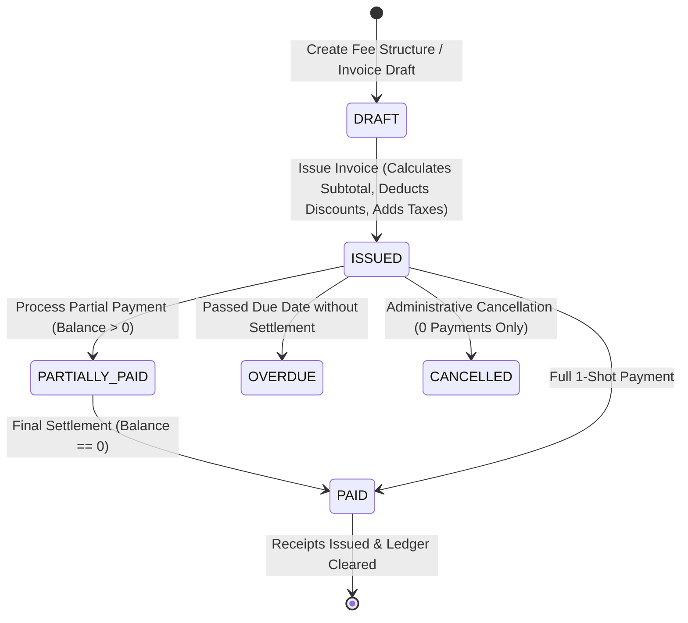
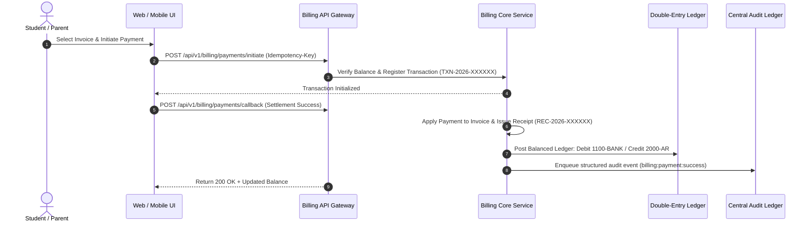

# Subsystem Specification: Central Payment & Billing System (Billing)

**Subsystem Key:** `billing`  
**Rank:** 5 of 17 (Topological Pre-requisite for Housing Allocations, Mess Tokens, Library Fines, and Exam Cards)  
**Status:** Implemented & Verified (100% Mock Unit & HTTP Integration Tests Passing)  

---

## 1. Domain Architecture & Double-Entry Accounting State Machine

---

## 2. Invariants & Business Rules

1. **Double-Entry Accounting Invariant:**
   - Every financial settlement creates paired journal entries satisfying:
     $$\sum \text{Debits} = \sum \text{Credits}$$
   - Any unbalanced transaction is atomically rejected with `ErrLedgerUnbalanced`.
2. **Idempotency Protection:**
   - Client requests with an `Idempotency-Key` return identical transaction responses if replayed, preventing duplicate debit charges.
3. **No Overpayments:**
   - Initiated payment amounts strictly cannot exceed `invoice.balance_amount`.
4. **Receipt Generation:**
   - Sequential, tamper-evident receipts formatted as `REC-{Year}-{Sequence:06d}`.
5. **Refund Cascades:**
   - Refunding a payment restores the student invoice balance and writes balancing reversal entries (Debit AR, Credit Bank/Cash).

---

## 3. Implemented Components & File Mapping

| Layer | Component | Path | Invariant / Purpose |
| :--- | :--- | :--- | :--- |
| **Database** | Prisma 8 Relational Schema | `database/schema.prisma` | PostgreSQL 18 models for `FeeStructure`, `FeeStructureItem`, `StudentInvoice`, `InvoiceItem`, `PaymentTransaction`, `LedgerAccount`, `LedgerEntry`. |
| **Domain** | Domain Core & Invariants | `backend/billing/domain.go` | Invoices, payment state machines, double-entry balance validation, and fee schedules. |
| **Domain** | Error Catalog | `backend/billing/errors.go` | Sentinels and structured `DomainError` mapped to RFC 7807 problem details. |
| **Domain** | Repository Contracts | `backend/billing/repository.go` | Interface contracts for fee structures, invoices, transactions, ledger, and sequences. |
| **Domain** | Business Service | `backend/billing/service.go` | Invoice generation, idempotency payments, double-entry ledger posting, refunds, and audit logging. |
| **Domain** | In-Memory Mock Repository | `backend/billing/mock_repository.go` | Thread-safe in-memory test doubles. |
| **Domain** | Unit Test Suite | `backend/billing/billing_test.go` | 5 exhaustive unit tests covering fee schedules, invoices, idempotency, double-entry, and refunds. |
| **API** | HTTP Transport Handlers | `api/http/billing/handler.go` | REST endpoints with RFC 7807 problem details and idempotency headers. |
| **API** | HTTP Transport Tests | `api/http/billing/handler_test.go` | REST integration tests for fee structures, invoices, checkout, and balances. |
| **Web Frontend** | TypeScript Types | `frontend/web/src/lib/types/billing.ts` | Frontend domain interfaces for invoices, fee categories, transactions, and ledger entries. |
| **Web Frontend** | Invoice Desk Component | `frontend/web/src/lib/components/billing/InvoiceDesk.svelte` | Interactive student invoice desk with itemized heads, split installments, and payment modal. |
| **Web Frontend** | Payment Ledger Component | `frontend/web/src/lib/components/billing/PaymentLedger.svelte` | Accounting ledger view with balance verification badge and receipts table. |
| **Web Frontend** | Billing Route Page | `frontend/web/src/routes/billing/+page.svelte` | Finance and billing dashboard. |
| **Mobile Frontend** | Mobile Billing Screen | `frontend/mobile/app/(app)/billing.tsx` | Mobile student fee payment, 1-tap UPI checkout, and receipts drawer. |

---

## 4. REST API Endpoint Catalog

| HTTP Method | Route | Description | Success Code |
| :--- | :--- | :--- | :--- |
| `POST` | `/api/v1/billing/fee-structures` | Create institutional fee template | `201 Created` |
| `POST` | `/api/v1/billing/invoices` | Generate student invoice with discounts/taxes | `201 Created` |
| `GET` | `/api/v1/billing/invoices` | List invoices with student and semester filters | `200 OK` |
| `GET` | `/api/v1/billing/invoices/{id}` | Get invoice itemized breakdown and status | `200 OK` |
| `POST` | `/api/v1/billing/payments/initiate` | Initiate payment checkout with idempotency key | `201 Created` |
| `POST` | `/api/v1/billing/payments/callback` | Process gateway settlement & issue receipt | `200 OK` |
| `POST` | `/api/v1/billing/payments/{id}/refund` | Refund payment and post reversal ledger entries | `200 OK` |
| `GET` | `/api/v1/billing/balances/students/{student_id}` | Get total outstanding fee balance for student | `200 OK` |
