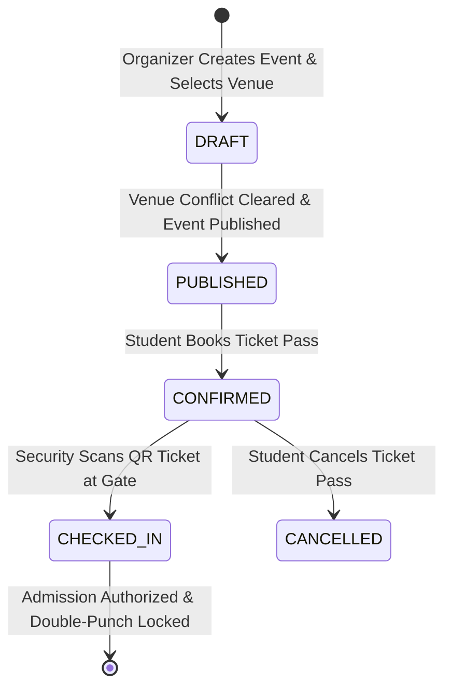
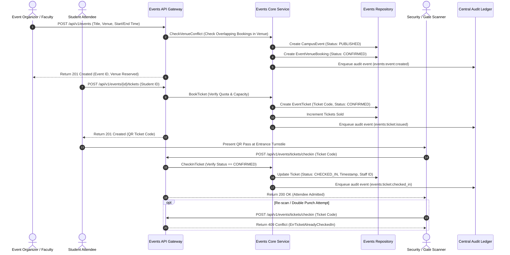

# Subsystem Specification: Event Organisation System (Events)

**Subsystem Key:** `events`  
**Rank:** 12 of 17 (Campus Events Calendar, Conflict-Free Venue Bookings, Digital RSVP / Ticketing, and Turnstile QR Gate Admissions)  
**Status:** Implemented & Verified (100% Mock Unit & HTTP Integration Tests Passing)  

---

## 1. Domain Architecture & Gate Check-In Lifecycle

---

## 2. Invariants & Business Rules

1. **Venue Conflict Invariant:**
   - No two events can book the same venue with intersecting time intervals:
     $$\text{Conflict} \iff \text{NewStart} < \text{ExistingEnd} \;\land\; \text{NewEnd} > \text{ExistingStart}$$
   - Overlapping booking attempts are atomically rejected with `ErrVenueConflict`.
2. **Quota & Capacity Ceiling:**
   - Total tickets issued cannot exceed $\min(\text{VenueCapacity}, \text{MaxTickets})$. Oversubscribed registration attempts fail with `ErrEventCapacityExceeded`.
3. **Single-Use Turnstile Check-In & Anti-Replay:**
   - QR ticket tokens are cryptographically derived. Each ticket code can be checked in exactly once. Duplicate scans fail with `ErrTicketAlreadyCheckedIn`.
4. **Registration Deadline Guard:**
   - Registration requests past the event `registrationDeadline` fail with `ErrRegistrationClosed`.
5. **Audit Trail:**
   - Every event created, venue reserved, ticket issued, and gate turnstile admission is published to the central tamper-evident audit ledger.

---

## 3. Implemented Components & File Mapping

| Layer | Component | Path | Invariant / Purpose |
| :--- | :--- | :--- | :--- |
| **Database** | Prisma 8 Relational Schema | `database/schema.prisma` | PostgreSQL 18 models for `CampusEvent`, `EventTicket`, `EventVenueBooking`. |
| **Domain** | Domain Core & Invariants | `backend/events/domain.go` | Venue interval overlap mathematics, cryptographic ticket codes, and check-in invariants. |
| **Domain** | Error Catalog | `backend/events/errors.go` | Domain error sentinels and RFC 7807 problem details mapping. |
| **Domain** | Repository Contracts | `backend/events/repository.go` | Interface contracts for events, venue bookings, conflicts, and ticketing. |
| **Domain** | Business Service | `backend/events/service.go` | Event orchestration, venue conflict detection, ticket reservations, gate admissions, and audit dispatching. |
| **Domain** | In-Memory Mock Repository | `backend/events/mock_repository.go` | Thread-safe test doubles for all events domain entities. |
| **Domain** | Unit Test Suite | `backend/events/events_test.go` | 5 comprehensive unit tests covering venue overlap guards, capacity caps, double-punch check-in prevention, and deadlines. |
| **API** | HTTP Transport Handlers | `api/http/events/handler.go` | REST endpoints with RFC 7807 problem details. |
| **API** | HTTP Transport Tests | `api/http/events/handler_test.go` | HTTP integration tests for event creation, ticket booking, and turnstile check-ins. |
| **Web Frontend** | TypeScript Types | `frontend/web/src/lib/types/events.ts` | Frontend domain interfaces for events, tickets, and venue bookings. |
| **Web Frontend** | Event Calendar Desk | `frontend/web/src/lib/components/events/EventCalendarDesk.svelte` | Interactive campus events schedule, category filters, real-time ticket quota booking, and venue reservation modal. |
| **Web Frontend** | Ticket Check-In Desk | `frontend/web/src/lib/components/events/TicketCheckInDesk.svelte` | Event entrance scanner terminal, single-use QR ticket punch validation, and turnstile access logs. |
| **Web Frontend** | Events Route Page | `frontend/web/src/routes/events/+page.svelte` | Unified events discovery and gate admissions dashboard. |
| **Mobile Frontend** | Mobile Events Screen | `frontend/mobile/app/(app)/events.tsx` | Mobile student campus events discovery, 1-tap ticket booking, and digital QR gate pass wallet. |

---

## 4. REST API Endpoint Catalog

| HTTP Method | Route | Description | Success Code |
| :--- | :--- | :--- | :--- |
| `POST` | `/api/v1/events` | Create new event & reserve venue | `201 Created` |
| `GET` | `/api/v1/events` | List events with category & status filters | `200 OK` |
| `GET` | `/api/v1/events/{id}` | Get event details | `200 OK` |
| `POST` | `/api/v1/events/{id}/tickets` | Book student pass for event | `201 Created` |
| `GET` | `/api/v1/events/{id}/tickets` | List tickets booked for an event | `200 OK` |
| `GET` | `/api/v1/events/tickets/my` | List student active / historical event passes | `200 OK` |
| `POST` | `/api/v1/events/tickets/checkin` | Turnstile gate scanner QR validation | `200 OK` |
