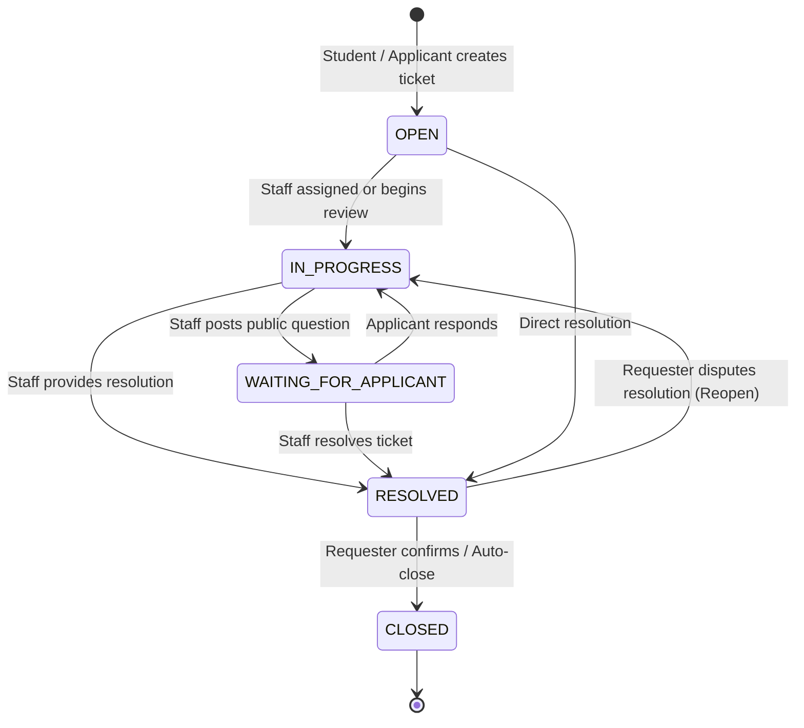
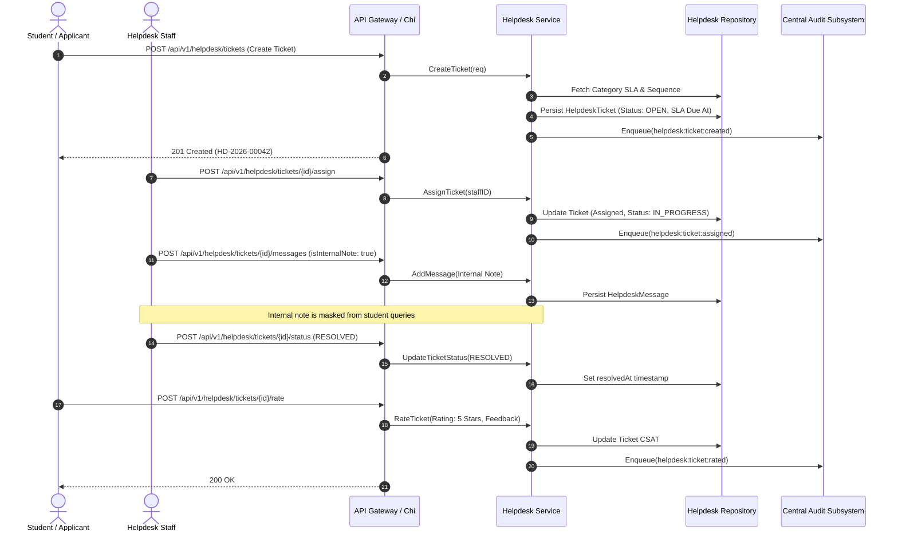

# Subsystem 13: Application & Query Helpdesk (`helpdesk`)

## 1. Overview & Business Context

The **Application & Query Helpdesk** is the central institutional support engine for the Campus Management System (CMS). It streamlines student and staff queries across academics, hostel maintenance, central fee billing, and IT infrastructure into unified, SLA-monitored resolution workflows.

Key architectural pillars:
- **Deterministic Ticket Identification:** Human-readable format (`HD-YYYY-NNNNN`) partitioned per tenant.
- **SLA Breach Surveillance Radar:** Dynamic countdown timers based on category response & resolution hour quotas.
- **Staff-Only Internal Notes:** Role-gated messages hidden from applicants to facilitate internal deliberation before official responses.
- **Dynamic Conversation State Engine:** Auto-transitions ticket status between `IN_PROGRESS` and `WAITING_FOR_APPLICANT` upon replies.
- **SLA Escalation Protocol:** 1-tap urgent escalation bumping priority to `URGENT` with audit trail dispatching.
- **Customer Satisfaction (CSAT) Rating:** 5-star rating and feedback loop gated to resolved or closed tickets.

---

## 2. Ticket State Machine & Lifecycle

---

## 3. SLA Escalation & Live Resolution Sequence

---

## 4. REST API Transport Endpoints

| HTTP Method | Path | Description | Access Control |
| :--- | :--- | :--- | :--- |
| `POST` | `/api/v1/helpdesk/categories` | Create Helpdesk Category & SLA config | Staff / Admin |
| `GET` | `/api/v1/helpdesk/categories` | List Active Categories | Public / Authenticated |
| `POST` | `/api/v1/helpdesk/tickets` | Submit new inquiry ticket | Authenticated User |
| `GET` | `/api/v1/helpdesk/tickets` | Filter tickets (status, priority, category) | Authenticated User |
| `GET` | `/api/v1/helpdesk/tickets/{id}` | Get ticket details and SLA timer | Requester / Staff |
| `POST` | `/api/v1/helpdesk/tickets/{id}/assign` | Assign ticket to support officer | Staff / Admin |
| `POST` | `/api/v1/helpdesk/tickets/{id}/status` | Transition ticket state | Staff / Requester |
| `POST` | `/api/v1/helpdesk/tickets/{id}/messages` | Post message (public or internal note) | Requester / Staff |
| `GET` | `/api/v1/helpdesk/tickets/{id}/messages` | Get message thread (internal notes masked for students) | Requester / Staff |
| `POST` | `/api/v1/helpdesk/tickets/{id}/escalate` | Trigger SLA Urgent Escalation | Requester / Staff |
| `POST` | `/api/v1/helpdesk/tickets/{id}/rate` | Submit CSAT satisfaction score (1-5 stars) | Ticket Requester |

---

## 5. PostgreSQL 18 / Prisma 8 Data Models

- `HelpdeskCategory`: Category taxonomy with default priority, SLA response and resolution hour thresholds.
- `HelpdeskTicket`: Core ticket entity tracking requester, assignee, SLA deadline, status lifecycle, and CSAT rating.
- `HelpdeskMessage`: Conversation thread elements with staff reply flag, internal note masking, and attachments.
- `HelpdeskEscalation`: Escalation incident logs tracking reasons, supervisor alerts, and escalation timestamps.
