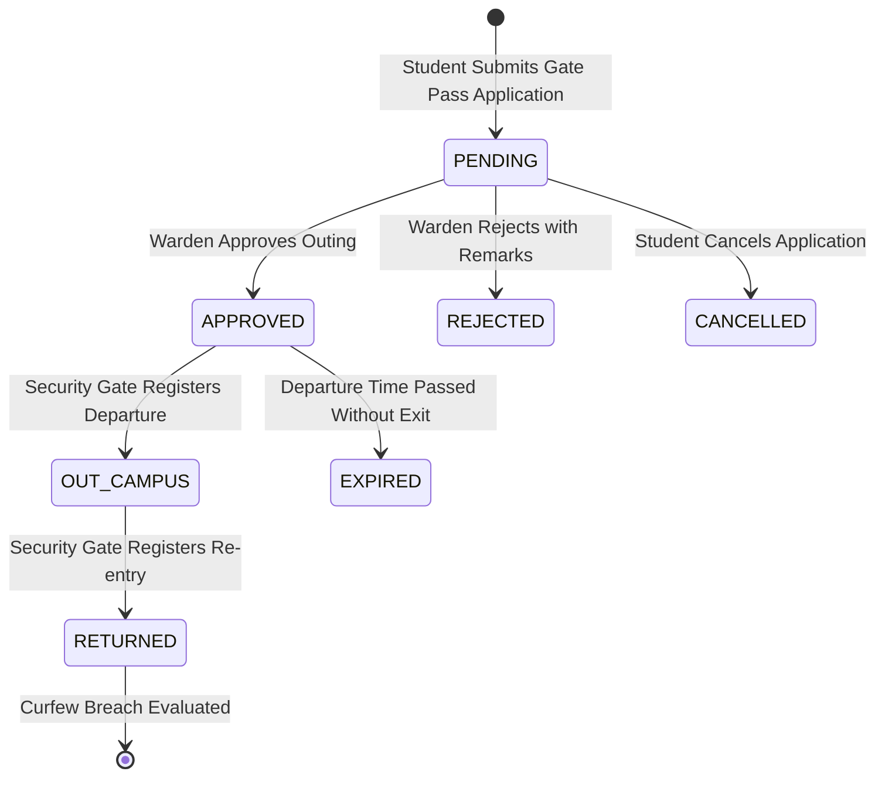
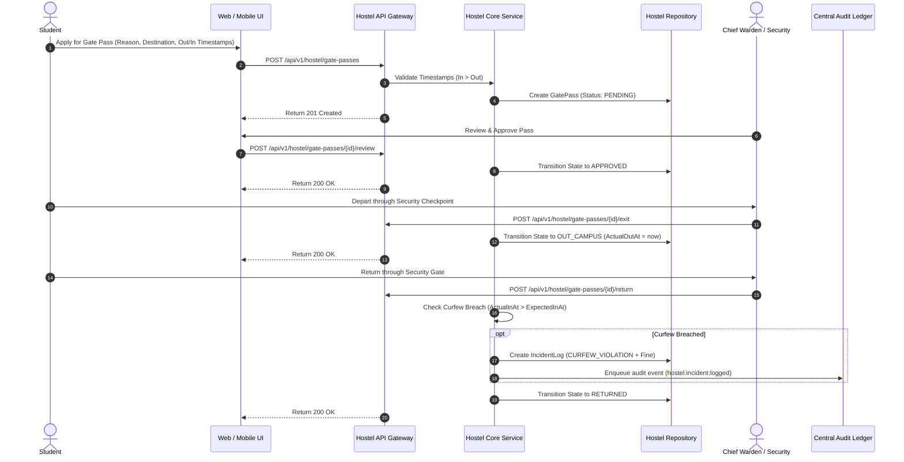

# Subsystem Specification: Hostel Management System (Hostel)

**Subsystem Key:** `hostel`  
**Rank:** 7 of 17 (Residential Blocks, Room/Bed Allocations, Digital Gate Passes, Warden Approvals, and Curfew Enforcement)  
**Status:** Implemented & Verified (100% Mock Unit & HTTP Integration Tests Passing)  

---

## 1. Domain Architecture & Gate Pass Lifecycle

---

## 2. Invariants & Business Rules

1. **Single Active Bed Allocation:**
   - A student can only have 1 active allocation (`ALLOCATED`) at any given time.
2. **Bed Occupancy Guard:**
   - A bed cannot be assigned to another student until the active allocation is transitioned to `VACATED`.
3. **Room Capacity Integrity:**
   - Maximum bed counts are strictly bound to room types (`SINGLE` = 1, `DOUBLE` = 2, `TRIPLE` = 3, `FOUR_SHARING` = 4).
4. **Gate Pass Chronology:**
   - Expected return time (`expected_in_at`) must be strictly after expected departure time (`expected_out_at`).
5. **Automatic Curfew Enforcement:**
   - If an actual return timestamp exceeds the authorized expected return time, a `CURFEW_VIOLATION` disciplinary incident is automatically logged, and penalty fines are accrued.
6. **Auditing:**
   - Block creations, bed assignments, vacate operations, and incident reports are immutably logged to the Central Audit Ledger.

---

## 3. Implemented Components & File Mapping

| Layer | Component | Path | Invariant / Purpose |
| :--- | :--- | :--- | :--- |
| **Database** | Prisma 8 Relational Schema | `database/schema.prisma` | PostgreSQL 18 models for `HostelBlock`, `HostelRoom`, `HostelBed`, `HostelBedAllocation`, `HostelGatePass`, `HostelIncidentLog`. |
| **Domain** | Domain Core & Invariants | `backend/hostel/domain.go` | Block hierarchies, room capacity validation, bed allocation state machines, gate pass transitions, curfew calculation. |
| **Domain** | Error Catalog | `backend/hostel/errors.go` | Domain error sentinels and RFC 7807 problem details mapping. |
| **Domain** | Repository Contracts | `backend/hostel/repository.go` | Interface contracts for blocks, rooms, beds, allocations, passes, and incidents. |
| **Domain** | Business Service | `backend/hostel/service.go` | Bed allocation orchestration, gate pass workflow, automated curfew fine generation, and audit logging. |
| **Domain** | In-Memory Mock Repository | `backend/hostel/mock_repository.go` | Thread-safe test doubles for hostel entities. |
| **Domain** | Unit Test Suite | `backend/hostel/hostel_test.go` | 6 comprehensive unit tests covering block hierarchies, allocation conflicts, gate passes, and curfew breach cascades. |
| **API** | HTTP Transport Handlers | `api/http/hostel/handler.go` | REST endpoints with RFC 7807 problem details. |
| **API** | HTTP Transport Tests | `api/http/hostel/handler_test.go` | HTTP integration tests for blocks, rooms, bed allocations, and curfew breaches. |
| **Web Frontend** | TypeScript Types | `frontend/web/src/lib/types/hostel.ts` | Frontend domain types for blocks, rooms, beds, allocations, passes, and incidents. |
| **Web Frontend** | Bed Allocation Grid Component | `frontend/web/src/lib/components/hostel/BedAllocationGrid.svelte` | Interactive room & bed matrix, occupancy badges, and 1-click allocation modal. |
| **Web Frontend** | Gate Pass Desk Component | `frontend/web/src/lib/components/hostel/GatePassDesk.svelte` | Outing pass desk, warden approvals, security gate logging, and curfew infraction drawer. |
| **Web Frontend** | Hostel Route Page | `frontend/web/src/routes/hostel/+page.svelte` | Comprehensive hostel dashboard. |
| **Mobile Frontend** | Mobile Hostel Screen | `frontend/mobile/app/(app)/hostel.tsx` | Mobile allotment details, gate pass application, and curfew rules. |

---

## 4. REST API Endpoint Catalog

| HTTP Method | Route | Description | Success Code |
| :--- | :--- | :--- | :--- |
| `POST` | `/api/v1/hostel/blocks` | Register a residential block | `201 Created` |
| `GET` | `/api/v1/hostel/blocks` | List residential blocks | `200 OK` |
| `POST` | `/api/v1/hostel/rooms` | Configure a room in a block | `201 Created` |
| `GET` | `/api/v1/hostel/rooms` | List rooms in a block | `200 OK` |
| `POST` | `/api/v1/hostel/beds` | Register a bed in a room | `201 Created` |
| `GET` | `/api/v1/hostel/beds` | List beds in a room | `200 OK` |
| `POST` | `/api/v1/hostel/allocations` | Allocate a bed to a student | `201 Created` |
| `POST` | `/api/v1/hostel/allocations/{id}/vacate` | Vacate an allocated bed | `200 OK` |
| `POST` | `/api/v1/hostel/gate-passes` | Apply for a digital gate pass | `201 Created` |
| `GET` | `/api/v1/hostel/gate-passes` | List gate passes with student/block filters | `200 OK` |
| `POST` | `/api/v1/hostel/gate-passes/{id}/review` | Warden review (approve/reject pass) | `200 OK` |
| `POST` | `/api/v1/hostel/gate-passes/{id}/exit` | Security checkpoint registers exit | `200 OK` |
| `POST` | `/api/v1/hostel/gate-passes/{id}/return` | Security checkpoint registers return (curfew check) | `200 OK` |
| `POST` | `/api/v1/hostel/incidents` | Log a disciplinary or curfew incident | `201 Created` |
| `GET` | `/api/v1/hostel/incidents` | List disciplinary incidents | `200 OK` |
