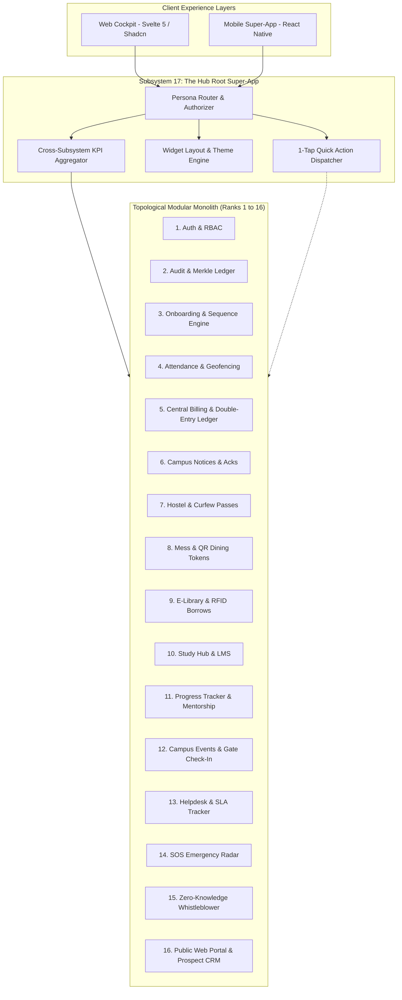
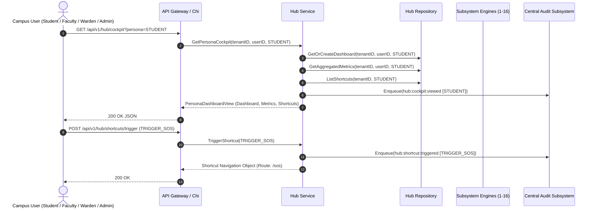

# Subsystem 17: The Hub Root Super-App (`hub`)

## 1. Overview & Business Context

The **Hub Root Super-App** is the central unifying cockpit and topological root of the Campus Management System (CMS). It aggregates live KPIs, metrics, and actionable alerts from all 16 modular subsystems (`auth`, `audit`, `onboarding`, `attendance`, `billing`, `notices`, `hostel`, `mess`, `library`, `studyhub`, `mentorship`, `events`, `helpdesk`, `sos`, `whistleblower`, `portal`), providing personalized cockpits for every institutional persona (`STUDENT`, `FACULTY`, `WARDEN`, `LIBRARIAN`, `ADMIN`, `SUPER_ADMIN`).

Key architectural pillars:
- **Unified Multi-Persona Cockpit:** Tailored dashboards surfacing domain-specific KPIs (e.g., student exam eligibility & balance, faculty grading workloads, warden curfew passes, librarian circulation metrics, admin financial inflows).
- **1-Tap Quick Action Shortcuts:** Context-aware shortcuts accelerating day-to-day interactions (e.g., geofenced attendance scan, 1-tap SOS distress trigger, meal QR code generation, fee payment, anonymous whistleblowing).
- **Dynamic Widget Layout Customizer:** End-user customization enabling modular cards to be reordered, resized (`SMALL`, `MEDIUM`, `LARGE`, `FULL_WIDTH`), and toggled based on preference.
- **Topological Telemetry Radar:** Real-time visibility into all 16 modular engine states, latency, and compliance status.
- **Audit & Activity Tracking:** Seamless audit emission (`hub:cockpit:viewed`, `hub:widgets:reconfigured`, `hub:shortcut:triggered`) enforcing full institutional traceability.

---

## 2. Super-App Architecture & Subsystem Aggregation Flow

---

## 3. Persona Cockpit Sequence Diagram

---

## 4. REST API Transport Endpoints

| HTTP Method | Path | Description | Access Control |
| :--- | :--- | :--- | :--- |
| `GET` | `/api/v1/hub/cockpit` | Retrieve consolidated persona dashboard, live KPIs, and shortcuts | Authenticated User |
| `POST` | `/api/v1/hub/widgets/reconfigure` | Save reordered and customized widget layout configuration | Authenticated User |
| `POST` | `/api/v1/hub/theme` | Update visual dashboard theme preference | Authenticated User |
| `GET` | `/api/v1/hub/shortcuts` | List persona-scoped 1-tap quick action shortcuts | Authenticated User |
| `POST` | `/api/v1/hub/shortcuts/trigger` | Execute and log 1-tap quick action trigger | Authenticated User |

---

## 5. PostgreSQL 18 / Prisma 8 Data Models

- `HubPersonaDashboard`: User-specific customized cockpit layout for a given persona.
- `HubWidgetConfig`: Individual widget card configuration (size, order index, enabled toggle, config JSON).
- `HubQuickActionShortcut`: 1-tap navigation and action trigger definitions per persona.
