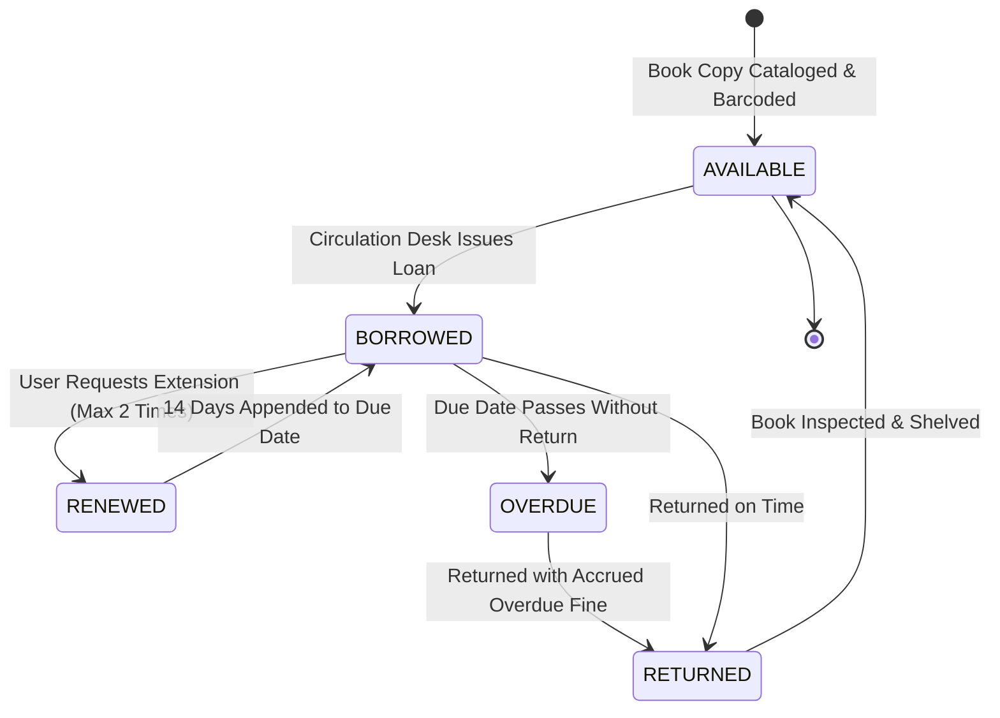
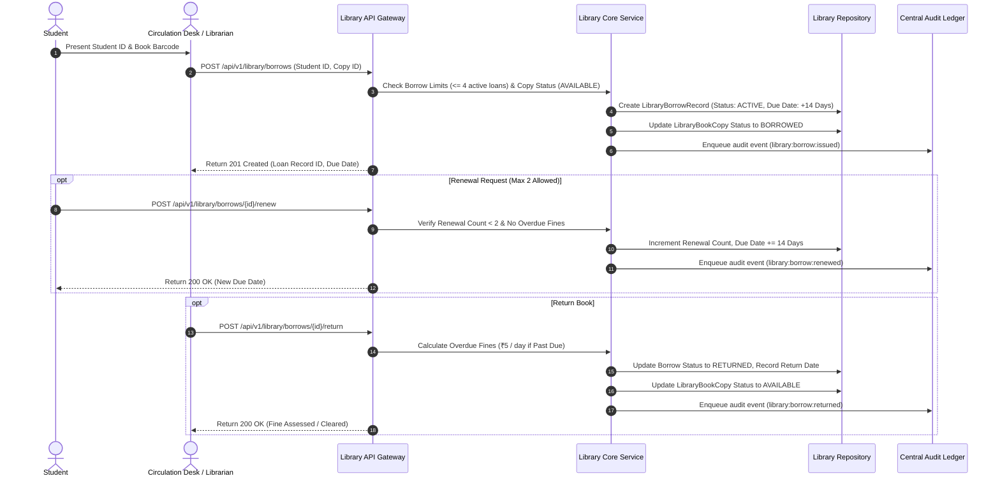

# Subsystem Specification: E-Library Management System (Library)

**Subsystem Key:** `library`  
**Rank:** 9 of 17 (Integrated Physical Book Catalog, Digital Borrow Loan Management, Overdue Fine Billing, Reservations, and E-Resource DRM)  
**Status:** Implemented & Verified (100% Mock Unit & HTTP Integration Tests Passing)  

---

## 1. Domain Architecture & Borrow Loan Lifecycle

---

## 2. Invariants & Business Rules

1. **Borrow Quota Limit:**
   - A student or faculty member can have at most 4 active book loans concurrently. Attempts to borrow more will fail with `ErrMaxBorrowLimitExceeded`.
2. **Copy Availability Invariant:**
   - A copy cannot be borrowed unless its status is `AVAILABLE`. Borrowing a borrowed or lost copy fails with `ErrCopyNotAvailable`.
3. **Loan Renewal Constraints:**
   - A borrowed book may be renewed up to 2 times, each extending the loan duration by 14 days. Loans exceeding 2 renewals fail with `ErrMaxRenewalsReached`. Overdue loans cannot be renewed.
4. **Automated Overdue Fine Calculation:**
   - Overdue loans accrue a fine at a rate of ₹5.00 per calendar day past the due date. The accrued fine is tracked on return and posted for billing reconciliation.
5. **Digital E-Book Access & Audit:**
   - Digital resource access requests verify active student enrollment and DRM tokens before streaming PDF/EPUB chapters. Every access, checkout, renewal, and return is published to the central audit ledger.

---

## 3. Implemented Components & File Mapping

| Layer | Component | Path | Invariant / Purpose |
| :--- | :--- | :--- | :--- |
| **Database** | Prisma 8 Relational Schema | `database/schema.prisma` | PostgreSQL 18 models for `LibraryBook`, `LibraryBookCopy`, `LibraryBorrowRecord`, `LibraryReservation`, `LibraryEbookAccess`. |
| **Domain** | Domain Core & Invariants | `backend/library/domain.go` | Borrow quotas ($\le 4$), renewal limits ($\le 2$), overdue fine computation ($₹5/\text{day}$), ISBN normalization. |
| **Domain** | Error Catalog | `backend/library/errors.go` | Domain error sentinels and RFC 7807 problem details mapping. |
| **Domain** | Repository Contracts | `backend/library/repository.go` | Interface contracts for books, physical copies, loans, holds/reservations, and e-resources. |
| **Domain** | Business Service | `backend/library/service.go` | Catalog management, borrow/return orchestration, renewals, reservations, and audit subscriber dispatch. |
| **Domain** | In-Memory Mock Repository | `backend/library/mock_repository.go` | Thread-safe test doubles for all library domain entities. |
| **Domain** | Unit Test Suite | `backend/library/library_test.go` | 6 comprehensive unit tests covering cataloging, loan issuing, quota enforcement, renewals, overdue fines, and reservations. |
| **API** | HTTP Transport Handlers | `api/http/library/handler.go` | REST endpoints with RFC 7807 problem details. |
| **API** | HTTP Transport Tests | `api/http/library/handler_test.go` | HTTP integration tests for catalog, borrow loans, renewals, returns, and reservations. |
| **Web Frontend** | TypeScript Types | `frontend/web/src/lib/types/library.ts` | Frontend domain interfaces for books, copies, loans, reservations, and digital assets. |
| **Web Frontend** | Book Catalog Desk Component | `frontend/web/src/lib/components/library/BookCatalogDesk.svelte` | Interactive book discovery desk, copy barcode inventory management, and new book registration modal. |
| **Web Frontend** | Borrow Loan Desk Component | `frontend/web/src/lib/components/library/BorrowLoanDesk.svelte` | Active loan management, 1-click renewal, return processing, and overdue fine status display. |
| **Web Frontend** | Library Route Page | `frontend/web/src/routes/library/+page.svelte` | Unified library circulation and inventory dashboard. |
| **Mobile Frontend** | Mobile Library Screen | `frontend/mobile/app/(app)/library.tsx` | Mobile student library portal with search, loan renewals, book reservations, and DRM e-book reading. |

---

## 4. REST API Endpoint Catalog

| HTTP Method | Route | Description | Success Code |
| :--- | :--- | :--- | :--- |
| `POST` | `/api/v1/library/books` | Register a new book title in catalog | `201 Created` |
| `GET` | `/api/v1/library/books` | List books with category & search filters | `200 OK` |
| `POST` | `/api/v1/library/copies` | Register a physical barcode copy | `201 Created` |
| `GET` | `/api/v1/library/copies` | List physical copies for a book | `200 OK` |
| `POST` | `/api/v1/library/borrows` | Issue a book copy loan to student/faculty | `201 Created` |
| `POST` | `/api/v1/library/borrows/{id}/renew` | Renew active borrow loan (+14 days) | `200 OK` |
| `POST` | `/api/v1/library/borrows/{id}/return` | Return book copy & calculate overdue fines | `200 OK` |
| `GET` | `/api/v1/library/borrows` | List active borrow loans | `200 OK` |
| `POST` | `/api/v1/library/reservations` | Place a hold/reservation on a checked-out book | `201 Created` |
| `GET` | `/api/v1/library/reservations` | List active reservations | `200 OK` |
| `POST` | `/api/v1/library/ebooks/access` | Record & authorize digital e-book access | `201 Created` |
