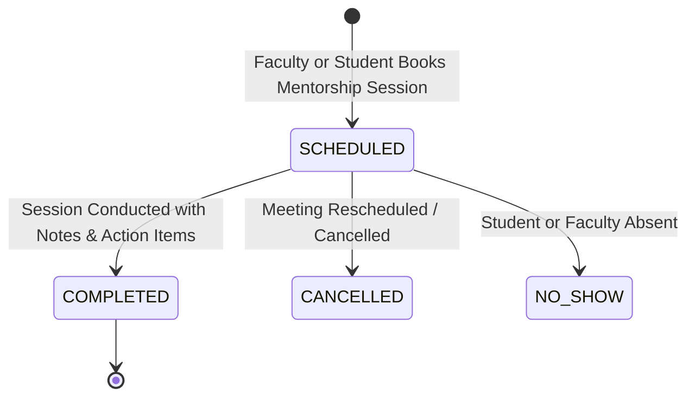
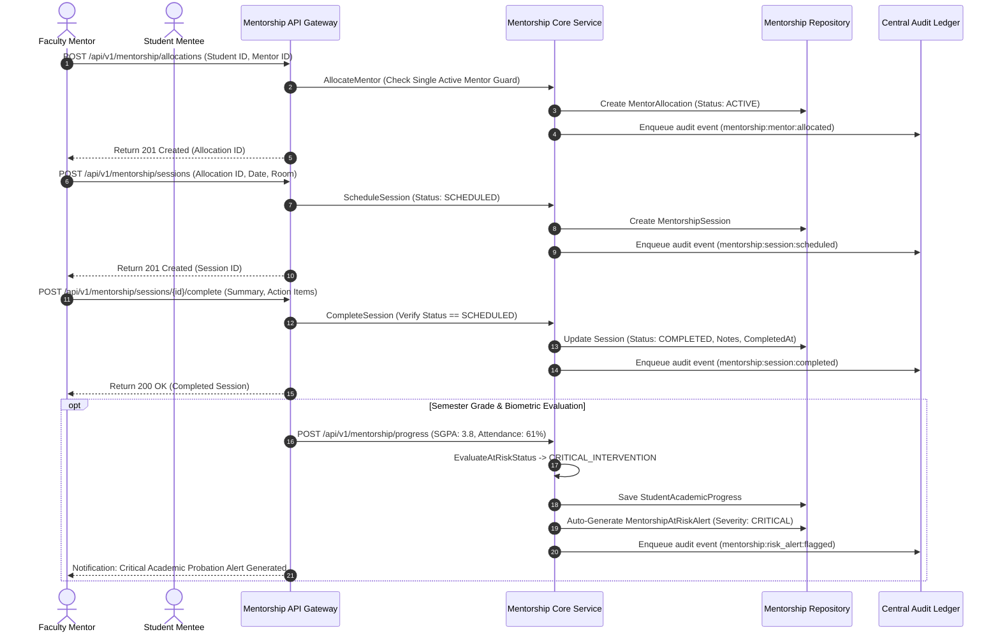

# Subsystem Specification: Progress Tracker & Mentorship System (Mentorship)

**Subsystem Key:** `mentorship`  
**Rank:** 11 of 17 (Faculty Mentor-Mentee Allocation, 1-on-1 Counseling Logs, Semester GPA & Attendance Surveillance, and Automated At-Risk Alerts)  
**Status:** Implemented & Verified (100% Mock Unit & HTTP Integration Tests Passing)  

---

## 1. Domain Architecture & Counseling / Risk Radar Flow

---

## 2. Invariants & Business Rules

1. **Single Active Mentor Allocation:**
   - A student can only have exactly one active faculty mentor allocation per cohort/academic year. Reallocation requires completing or archiving the prior record.
2. **Automated At-Risk Early Warning Radar:**
   - Evaluates academic standing at the conclusion of each semester or continuous assessment cycle:
     - **Normal:** $\text{Attendance} \ge 75\%$ and $\text{SGPA} \ge 5.0$.
     - **Watchlist:** $\text{Attendance} < 75\%$ or $\text{SGPA} < 5.0 \implies \text{WATCHLIST}$ (Severity: `LOW` / `MEDIUM`).
     - **Critical Intervention:** $\text{Attendance} < 65\%$ or $\text{SGPA} < 4.0 \implies \text{CRITICAL\_INTERVENTION}$ (Severity: `CRITICAL`).
   - Flagged students automatically trigger a `MentorshipAtRiskAlert` dispatched to their assigned mentor and Dean of Student Affairs.
3. **Session Immutability:**
   - Only `SCHEDULED` sessions can be marked `COMPLETED` or `CANCELLED`. Once marked `COMPLETED`, discussion notes and timestamps are immutable.
4. **Score Bounds Validation:**
   - GPAs must strictly lie in $[0.0, 10.0]$ and attendance percentages in $[0.0, 100.0]$. Out-of-range inputs fail with `ErrInvalidScoreBounds`.

---

## 3. Implemented Components & File Mapping

| Layer | Component | Path | Invariant / Purpose |
| :--- | :--- | :--- | :--- |
| **Database** | Prisma 8 Relational Schema | `database/schema.prisma` | PostgreSQL 18 models for `MentorAllocation`, `MentorshipSession`, `StudentAcademicProgress`, `MentorshipAtRiskAlert`. |
| **Domain** | Domain Core & Invariants | `backend/mentorship/domain.go` | At-risk radar thresholds, session completion state transitions, score bounds guards. |
| **Domain** | Error Catalog | `backend/mentorship/errors.go` | Domain error sentinels and RFC 7807 problem details mapping. |
| **Domain** | Repository Contracts | `backend/mentorship/repository.go` | Interface contracts for allocations, counseling sessions, academic progress, and risk alerts. |
| **Domain** | Business Service | `backend/mentorship/service.go` | Mentor assignments, counseling session logs, progress evaluations, alert generation, and audit dispatching. |
| **Domain** | In-Memory Mock Repository | `backend/mentorship/mock_repository.go` | Thread-safe test doubles for all mentorship entities. |
| **Domain** | Unit Test Suite | `backend/mentorship/mentorship_test.go` | 5 comprehensive unit tests covering allocations, sessions, progress calculations, and risk alerts. |
| **API** | HTTP Transport Handlers | `api/http/mentorship/handler.go` | REST endpoints with RFC 7807 problem details. |
| **API** | HTTP Transport Tests | `api/http/mentorship/handler_test.go` | HTTP integration tests for allocations, sessions, progress logs, and alert resolutions. |
| **Web Frontend** | TypeScript Types | `frontend/web/src/lib/types/mentorship.ts` | Frontend domain interfaces for allocations, sessions, progress records, and alerts. |
| **Web Frontend** | Mentor Allocation Desk | `frontend/web/src/lib/components/mentorship/MentorAllocationDesk.svelte` | Faculty mentor allocation matrix, cohort distribution stats, and mentee assignment modal. |
| **Web Frontend** | Mentorship Counseling Desk | `frontend/web/src/lib/components/mentorship/MentorshipCounselingDesk.svelte` | Counseling session calendar, discussion notes logger, and at-risk early warning alert resolution panel. |
| **Web Frontend** | Mentorship Route Page | `frontend/web/src/routes/mentorship/+page.svelte` | Unified progress tracking and mentorship dashboard. |
| **Mobile Frontend** | Mobile Mentorship Screen | `frontend/mobile/app/(app)/mentorship.tsx` | Mobile student portal for mentor contact, 1-on-1 meeting requests, session logs, and GPA progress. |

---

## 4. REST API Endpoint Catalog

| HTTP Method | Route | Description | Success Code |
| :--- | :--- | :--- | :--- |
| `POST` | `/api/v1/mentorship/allocations` | Assign faculty mentor to student | `201 Created` |
| `GET` | `/api/v1/mentorship/allocations` | List mentor allocations with filters | `200 OK` |
| `GET` | `/api/v1/mentorship/allocations/active` | Get student active mentor allocation | `200 OK` |
| `POST` | `/api/v1/mentorship/sessions` | Schedule 1-on-1 counseling meeting | `201 Created` |
| `GET` | `/api/v1/mentorship/allocations/{id}/sessions` | List counseling session history | `200 OK` |
| `POST` | `/api/v1/mentorship/sessions/{id}/complete` | Log session notes and mark completed | `200 OK` |
| `POST` | `/api/v1/mentorship/progress` | Evaluate semester GPA & attendance metrics | `201 Created` |
| `GET` | `/api/v1/mentorship/progress` | Get student academic progress history | `200 OK` |
| `GET` | `/api/v1/mentorship/alerts` | List active / resolved at-risk alerts | `200 OK` |
| `POST` | `/api/v1/mentorship/alerts/{id}/resolve` | Mentor / Dean resolve at-risk case | `200 OK` |
