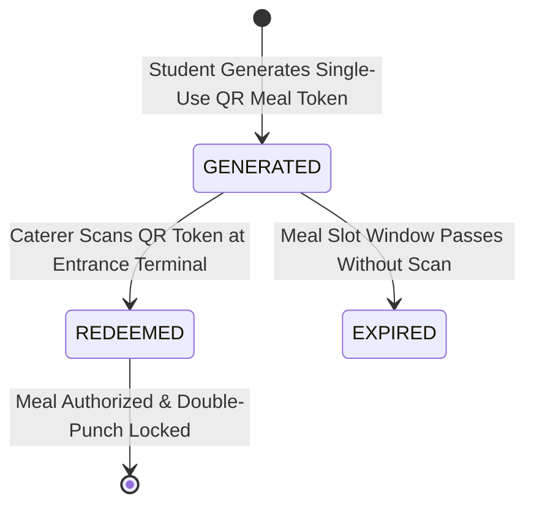

# Subsystem Specification: Mess Management System (Mess)

**Subsystem Key:** `mess`  
**Rank:** 8 of 17 (Dining Facilities, Weekly Nutrition Menus, Single-Use QR Meal Tokens, Double-Punch Prevention, and Leave Rebates)  
**Status:** Implemented & Verified (100% Mock Unit & HTTP Integration Tests Passing)  

---

## 1. Domain Architecture & Dining Token Flow



```mermaid
sequenceDiagram
    autonumber
    actor Student as Student
    participant Web as Web / Mobile App
    participant API as Mess API Gateway
    participant Svc as Mess Core Service
    participant Repo as Mess Repository
    actor Caterer as Mess Entrance Scanner
    participant Audit as Central Audit Ledger

    Student->>Web: Request QR Meal Token (e.g. Lunch)
    Web->>API: POST /api/v1/mess/tokens/daily
    API->>Svc: Verify Active Subscription & Slot Uniqueness
    Svc->>Repo: Create MessDiningToken (Status: GENERATED)
    API-->>Web: Return 201 Created (Token Code / QR)

    Student->>Caterer: Present QR Token at Dining Entrance
    Caterer->>API: POST /api/v1/mess/tokens/redeem (Token Code)
    Svc->>Svc: Validate Token (Must be GENERATED; Check Double Redemption)
    Svc->>Repo: Update Token to REDEEMED (Timestamp + Reader ID)
    Svc->>Audit: Enqueue audit event (mess:token:redeemed)
    API-->>Caterer: Return 200 OK (Meal Serving Authorized)

    opt Student Re-scans Token (Double Punch)
        Caterer->>API: POST /api/v1/mess/tokens/redeem (Token Code)
        API-->>Caterer: Return 409 Conflict (ErrTokenAlreadyRedeemed)
    end
```

---

## 2. Invariants & Business Rules

1. **Single-Use Meal Punch Invariant:**
   - A student can only generate and redeem exactly 1 meal token per meal slot (`BREAKFAST`, `LUNCH`, `SNACKS`, `DINNER`) per calendar day. Duplicate punch attempts are atomically rejected with `ErrTokenAlreadyRedeemed`.
2. **Rebate Absence Duration Threshold:**
   - Dining fee rebates require a continuous leave absence of at least 3 full calendar days ($\ge 3$ days). Submissions under 3 days are rejected with `ErrInsufficientRebateDays`.
3. **Deterministic Token Cryptography:**
   - Token codes are cryptographically derived from tenant ID, student ID, date, and meal slot to prevent token forgery.
4. **Audit Integration:**
   - Token redemptions, mess hall registrations, subscription provisioning, and approved rebate credits are securely recorded into the central audit ledger.

---

## 3. Implemented Components & File Mapping

| Layer | Component | Path | Invariant / Purpose |
| :--- | :--- | :--- | :--- |
| **Database** | Prisma 8 Relational Schema | `database/schema.prisma` | PostgreSQL 18 models for `MessHall`, `MessMenuItem`, `MessSubscription`, `MessDiningToken`, `MessRebateApplication`, `MessMealFeedback`. |
| **Domain** | Domain Core & Invariants | `backend/mess/domain.go` | Token cryptography, meal slots, dietary classification, double-punch validation, rebate rules. |
| **Domain** | Error Catalog | `backend/mess/errors.go` | Domain error sentinels and RFC 7807 problem details mapping. |
| **Domain** | Repository Contracts | `backend/mess/repository.go` | Interface contracts for halls, weekly menus, subscriptions, tokens, rebates, feedbacks. |
| **Domain** | Business Service | `backend/mess/service.go` | Token generation & redemption, weekly menu scheduling, rebate processing, and audit dispatching. |
| **Domain** | In-Memory Mock Repository | `backend/mess/mock_repository.go` | Thread-safe test doubles for mess entities. |
| **Domain** | Unit Test Suite | `backend/mess/mess_test.go` | 5 comprehensive unit tests covering token lifecycle, double-punch prevention, rebates, and meal feedback. |
| **API** | HTTP Transport Handlers | `api/http/mess/handler.go` | REST endpoints with RFC 7807 problem details. |
| **API** | HTTP Transport Tests | `api/http/mess/handler_test.go` | HTTP integration tests for halls, menus, QR punches, rebates, and feedbacks. |
| **Web Frontend** | TypeScript Types | `frontend/web/src/lib/types/mess.ts` | Frontend domain interfaces for mess halls, menus, subscriptions, tokens, and rebates. |
| **Web Frontend** | Dining Token Scanner Component | `frontend/web/src/lib/components/mess/DiningTokenScanner.svelte` | Digital QR pass display, live countdown validity, and entrance punch validator terminal. |
| **Web Frontend** | Mess Menu Desk Component | `frontend/web/src/lib/components/mess/MessMenuDesk.svelte` | 7-day weekly menu viewer with calorie breakdown, dietary filters, and rebate application drawer. |
| **Web Frontend** | Mess Route Page | `frontend/web/src/routes/mess/+page.svelte` | Dining dashboard page. |
| **Mobile Frontend** | Mobile Mess Screen | `frontend/mobile/app/(app)/mess.tsx` | Mobile 1-tap meal token pass, today's menu, and rebate requests. |

---

## 4. REST API Endpoint Catalog

| HTTP Method | Route | Description | Success Code |
| :--- | :--- | :--- | :--- |
| `POST` | `/api/v1/mess/halls` | Register a dining facility | `201 Created` |
| `GET` | `/api/v1/mess/halls` | List dining facilities | `200 OK` |
| `POST` | `/api/v1/mess/menu-items` | Schedule weekly dish item | `201 Created` |
| `GET` | `/api/v1/mess/menu-items` | List menu items with day/meal filters | `200 OK` |
| `POST` | `/api/v1/mess/subscriptions` | Enroll student in dining plan | `201 Created` |
| `POST` | `/api/v1/mess/tokens/daily` | Generate single-use meal token | `201 Created` |
| `POST` | `/api/v1/mess/tokens/redeem` | Entrance scanner punch validation | `200 OK` |
| `GET` | `/api/v1/mess/tokens` | List student dining tokens | `200 OK` |
| `POST` | `/api/v1/mess/rebates` | Apply for mess fee rebate ($\ge 3$ days) | `201 Created` |
| `POST` | `/api/v1/mess/rebates/{id}/approve` | Warden / Manager approve fee rebate | `200 OK` |
| `GET` | `/api/v1/mess/rebates` | List student rebate applications | `200 OK` |
| `POST` | `/api/v1/mess/feedbacks` | Submit meal satisfaction feedback | `201 Created` |
| `GET` | `/api/v1/mess/feedbacks` | List feedback by dining hall | `200 OK` |
