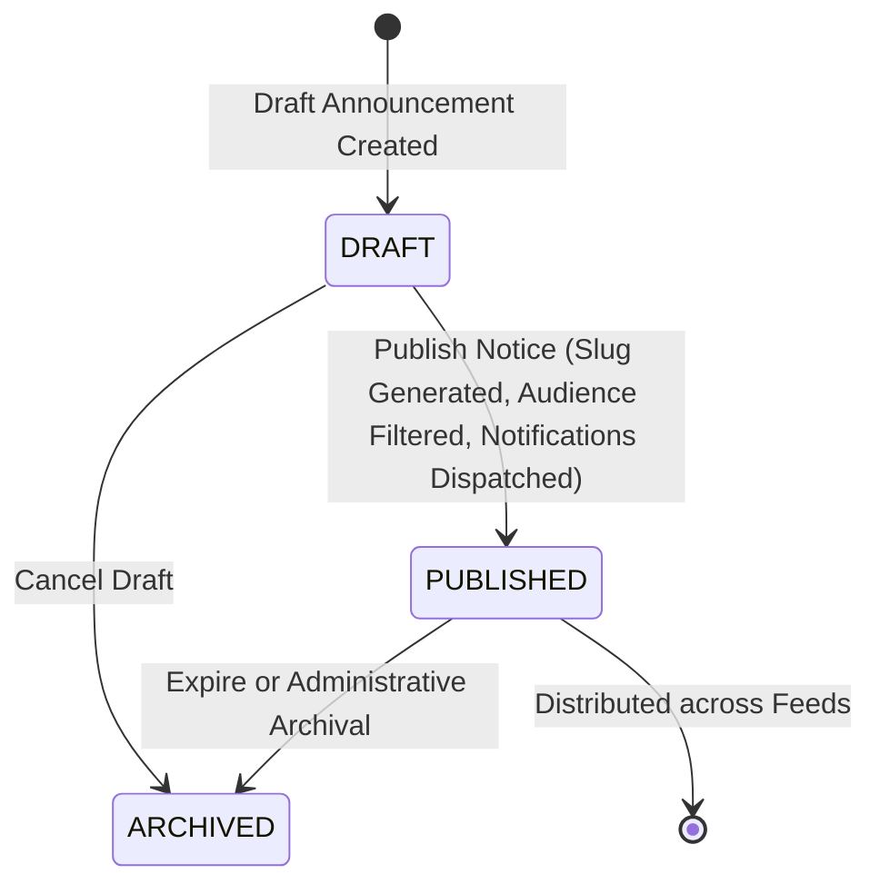
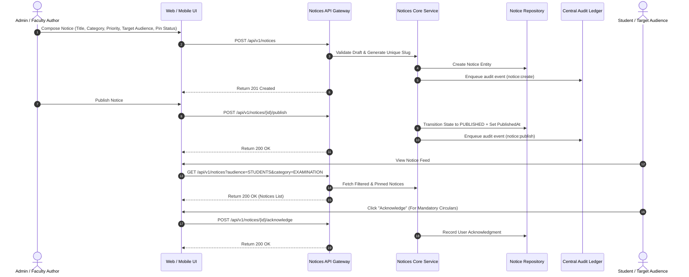

# Subsystem Specification: Notice & Announcement System (Notices)

**Subsystem Key:** `notices`  
**Rank:** 6 of 17 (Official Campus Circulars, Departmental Bulletins, Emergency Alerts, and Mandatory Acknowledgement Tracking)  
**Status:** Implemented & Verified (100% Mock Unit & HTTP Integration Tests Passing)  

---

## 1. Domain Architecture & Notice Lifecycle

---

## 2. Invariants & Business Rules

1. **Mandatory Slug Uniqueness:**
   - Every published circular is assigned a human-readable, URL-safe slug derived from title and timestamp.
2. **Audience Segmentation:**
   - Notices are strictly segmented by audience (`ALL`, `STUDENTS`, `FACULTY`, `STAFF`, `ALUMNI`).
3. **Priority & Pinning Invariant:**
   - Urgent notices and pinned circulars are automatically placed at the top of feed queries.
4. **Mandatory Circular Tracking:**
   - For notices with `requires_ack = true`, read/acknowledgement timestamps are captured per student/faculty recipient.
5. **Auditing:**
   - Notice creations, edits, publishes, and acknowledgements are sent to the Central Audit & Compliance ledger.

---

## 3. Implemented Components & File Mapping

| Layer | Component | Path | Invariant / Purpose |
| :--- | :--- | :--- | :--- |
| **Database** | Prisma 8 Relational Schema | `database/schema.prisma` | PostgreSQL 18 models for `CampusNotice`, `NoticeAttachment`, `NoticeAcknowledgement`. |
| **Domain** | Domain Core & Invariants | `backend/notices/domain.go` | Notice state machine, slug generation, audience targeting, and acknowledgements. |
| **Domain** | Error Catalog | `backend/notices/errors.go` | Domain sentinels and RFC 7807 problem details error mapping. |
| **Domain** | Repository Contracts | `backend/notices/repository.go` | Interface contracts for notices, attachments, and acknowledgements. |
| **Domain** | Business Service | `backend/notices/service.go` | Notice publishing, filtering, acknowledgment recording, and audit integration. |
| **Domain** | In-Memory Mock Repository | `backend/notices/mock_repository.go` | Thread-safe test doubles for notice entities. |
| **Domain** | Unit Test Suite | `backend/notices/notices_test.go` | 5 comprehensive unit tests for drafting, publishing, audience filtering, and ack tracking. |
| **API** | HTTP Transport Handlers | `api/http/notices/handler.go` | REST endpoints with audience and category filtering. |
| **API** | HTTP Transport Tests | `api/http/notices/handler_test.go` | HTTP integration tests for notice creation, listing, publishing, and acknowledging. |
| **Web Frontend** | TypeScript Types | `frontend/web/src/lib/types/notices.ts` | Frontend domain types for notices, priorities, categories, and acknowledgements. |
| **Web Frontend** | Notice Feed Component | `frontend/web/src/lib/components/notices/NoticeFeed.svelte` | Feed with search, category filtering, pinned badges, and 1-click acknowledgement. |
| **Web Frontend** | Notice Composer Component | `frontend/web/src/lib/components/notices/NoticeComposer.svelte` | Administrative notice composer modal with audience targeting. |
| **Web Frontend** | Notices Route Page | `frontend/web/src/routes/notices/+page.svelte` | Web announcements dashboard. |
| **Mobile Frontend** | Mobile Notices Screen | `frontend/mobile/app/(app)/notices.tsx` | Mobile circular feed with category pills and ack actions. |

---

## 4. REST API Endpoint Catalog

| HTTP Method | Route | Description | Success Code |
| :--- | :--- | :--- | :--- |
| `POST` | `/api/v1/notices` | Create a draft notice | `201 Created` |
| `GET` | `/api/v1/notices` | List published notices (supports audience, category, status filters) | `200 OK` |
| `GET` | `/api/v1/notices/{id}` | Get notice by ID | `200 OK` |
| `POST` | `/api/v1/notices/{id}/publish` | Publish a draft notice | `200 OK` |
| `POST` | `/api/v1/notices/{id}/acknowledge` | Record user acknowledgement for a circular | `200 OK` |
| `GET` | `/api/v1/notices/{id}/acknowledgements` | List user acknowledgements for compliance reporting | `200 OK` |
