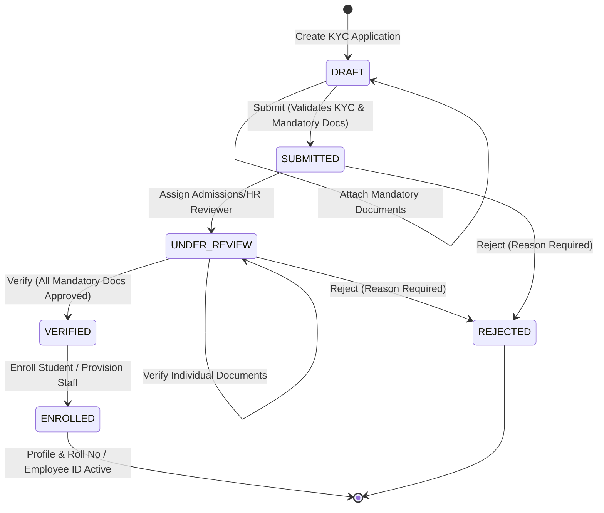

# Subsystem Specification: Student & Staff Registration System (Onboarding)

**Subsystem Key:** `onboarding`  
**Rank:** 3 of 17 (Topological Pre-requisite for Academics, Attendance, Billing, and Housing)  
**Status:** Implemented & Verified (100% Mock Unit & HTTP Integration Tests Passing)  

---

## 1. Domain Architecture & Lifecycle State Machine

---

## 2. Invariants & Deterministic Sequencing Rules

1. **Mandatory KYC Document Invariants:**
   - **Student Applications:** Require `NATIONAL_ID`, `ACADEMIC_TRANSCRIPT`, and `PASSPORT_PHOTO`.
   - **Faculty & Staff Applications:** Require `NATIONAL_ID`, `DEGREE_CERTIFICATE`, and `PASSPORT_PHOTO`.
   - Applications cannot transition from `DRAFT` $\to$ `SUBMITTED` or `UNDER_REVIEW` $\to$ `VERIFIED` if any mandatory document is missing, pending review, or rejected.
2. **Deterministic, Concurrency-Safe Identity Sequences:**
   - **Roll Number Format:** `{AcademicYearPrefix}-{ProgramCode}-{Sequence:04d}` (e.g. `2026-BTECH_CSE-0001`, `2026-BTECH_CSE-0002`).
   - **Employee ID Format:** `EMP-{DepartmentCode}-{Sequence:04d}` (e.g. `EMP-CSE-0001`).
   - **Registration Number Format:** `REG-{StartYear}-{Sequence:05d}` (e.g. `REG-2026-00001`).
   - Atomic reservation guarantees zero collisions under high concurrency.
3. **Cohort Capacity Enforcement:**
   - Student enrollment validates that the target `CohortBatch` has not exceeded `max_capacity`.
4. **Audit Trail Event Publishing:**
   - Emits structured domain audit events (`onboarding:applicant:draft_created`, `onboarding:applicant:submitted`, `onboarding:document:attached`, `onboarding:document:verified`, `onboarding:applicant:verified`, `onboarding:student:enrolled`, `onboarding:staff:provisioned`) to the Rank 2 immutable audit ledger.

---

## 3. Implemented Components & File Mapping

| Layer | Component | Path | Invariant / Purpose |
| :--- | :--- | :--- | :--- |
| **Database** | Prisma Relational Schema | `database/schema.prisma` | PostgreSQL 18 models for `AcademicDepartment`, `AcademicProgram`, `CohortBatch`, `OnboardingApplicant`, `OnboardingDocument`, `StudentProfile`, `StaffProfile`, `IdentitySequenceCounter`. |
| **Domain** | Domain Core & State Machine | `backend/onboarding/domain.go` | Applicant & Document aggregates, KYC validations, and state machine transitions. |
| **Domain** | Error Catalog | `backend/onboarding/errors.go` | Domain errors mapped to RFC 7807 problem details. |
| **Domain** | Sequence Engine | `backend/onboarding/sequence.go` | Deterministic Roll Number and Employee ID generator. |
| **Domain** | Repository Contracts | `backend/onboarding/repository.go` | Data access interfaces for applicant, document, academic, profile, and sequence persistence. |
| **Domain** | Orchestration Service | `backend/onboarding/service.go` | Service orchestrating KYC submission, document reviews, sequence allocation, and audit events. |
| **Domain** | In-Memory Mock Repository | `backend/onboarding/mock_repository.go` | Thread-safe in-memory doubles for testing. |
| **Domain** | Domain Test Suite | `backend/onboarding/onboarding_test.go` | 10 exhaustive unit tests covering state transitions, validation, and concurrency (74.6% coverage). |
| **API** | HTTP REST Handlers | `api/http/onboarding/handler.go` | REST transport endpoints with RFC 7807 error responses and pagination. |
| **API** | HTTP Transport Tests | `api/http/onboarding/handler_test.go` | HTTP integration tests for draft creation, document verification, enrollment, and catalog queries (54.8% coverage). |
| **Web Frontend** | TypeScript Domain Types | `frontend/web/src/lib/types/onboarding.ts` | Frontend interfaces for applicants, documents, departments, programs, and profiles. |
| **Web Frontend** | KYC Application Form | `frontend/web/src/lib/components/onboarding/KYCApplicationForm.svelte` | Multi-step interactive KYC form with live document attachments. |
| **Web Frontend** | Admissions Verification Desk | `frontend/web/src/lib/components/onboarding/VerificationQueue.svelte` | Registrar queue with document review and enrollment triggers. |
| **Web Frontend** | Public & Admin Routes | `frontend/web/src/routes/onboarding/+page.svelte`, `admin/onboarding/+page.svelte` | Public application portal and Admissions Admin Desk. |
| **Mobile Frontend** | Mobile KYC Screen | `frontend/mobile/app/(app)/onboarding.tsx` | Mobile KYC application and live admissions status tracking. |

---

## 4. REST API Endpoint Catalog

| HTTP Method | Route | Description | Success Code |
| :--- | :--- | :--- | :--- |
| `POST` | `/api/v1/onboarding/applicants` | Create KYC application draft | `201 Created` |
| `GET` | `/api/v1/onboarding/applicants` | List applicants with pagination & filters | `200 OK` |
| `GET` | `/api/v1/onboarding/applicants/{id}` | Get applicant details & document checklist | `200 OK` |
| `PATCH` | `/api/v1/onboarding/applicants/{id}` | Update applicant draft fields | `200 OK` |
| `POST` | `/api/v1/onboarding/applicants/{id}/documents` | Attach KYC document | `201 Created` |
| `PATCH` | `/api/v1/onboarding/applicants/{id}/documents/{doc_id}` | Approve or reject document | `200 OK` |
| `POST` | `/api/v1/onboarding/applicants/{id}/submit` | Submit application (`DRAFT` $\to$ `SUBMITTED`) | `200 OK` |
| `POST` | `/api/v1/onboarding/applicants/{id}/review` | Assign reviewer (`SUBMITTED` $\to$ `UNDER_REVIEW`) | `200 OK` |
| `POST` | `/api/v1/onboarding/applicants/{id}/verify` | Verify application (`UNDER_REVIEW` $\to$ `VERIFIED`) | `200 OK` |
| `POST` | `/api/v1/onboarding/applicants/{id}/reject` | Reject application (`REJECTED`) | `200 OK` |
| `POST` | `/api/v1/onboarding/applicants/{id}/enroll` | Enroll student & generate Roll Number | `201 Created` |
| `POST` | `/api/v1/onboarding/applicants/{id}/provision` | Provision staff & generate Employee ID | `201 Created` |
| `GET` | `/api/v1/onboarding/departments` | List academic departments | `200 OK` |
| `GET` | `/api/v1/onboarding/programs` | List academic programs | `200 OK` |
| `GET` | `/api/v1/onboarding/cohorts` | List cohort batches | `200 OK` |
