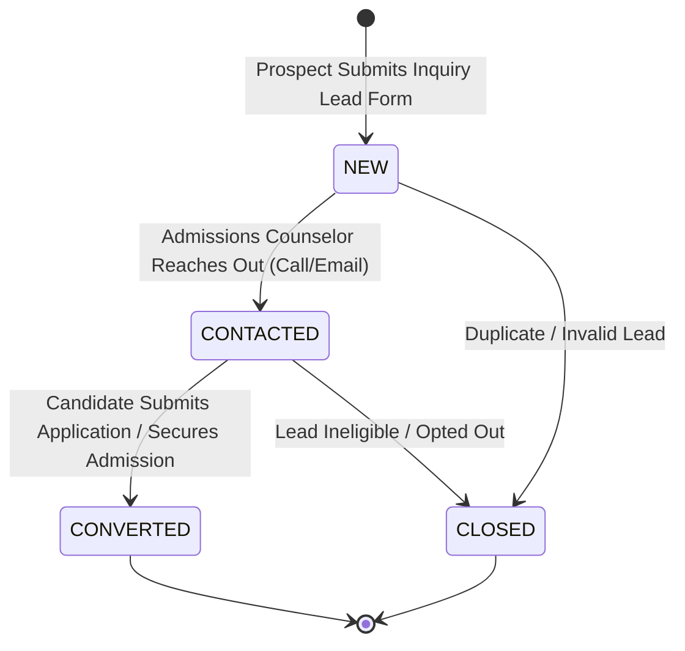
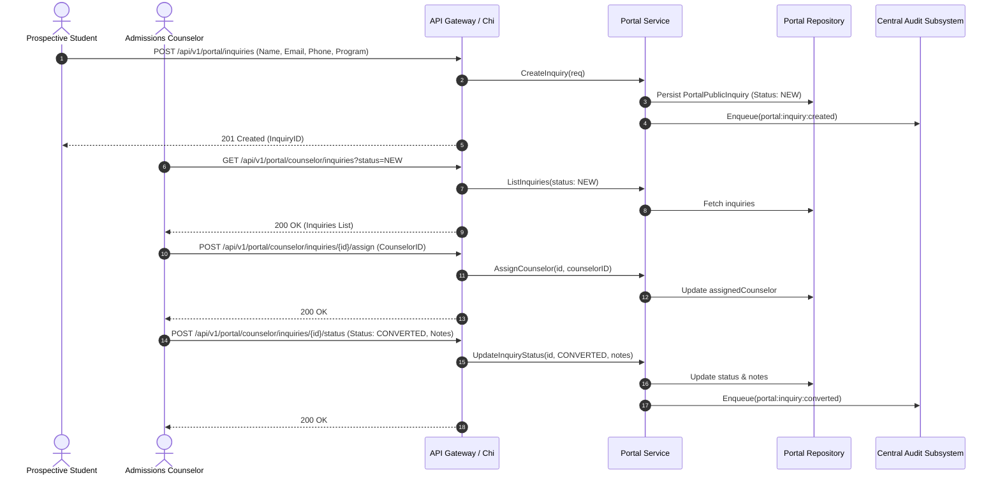

# Subsystem 16: Public Web Portal (`portal`)

## 1. Overview & Business Context

The **Public Web Portal** subsystem serves as the institution's public-facing digital storefront and prospective student admissions gateway. It manages institutional landing pages, academic program catalogs across undergraduate, postgraduate, diploma, and doctoral tracks, admissions cycle announcements, and prospect lead capture.

Key architectural pillars:
- **Public Prospectus Catalog:** Dynamic program listing including degree levels (`UG`, `PG`, `DIPLOMA`, `PHD`), duration, total semesters, minimum eligibility criteria, and annual fee schedules.
- **Inquiry & Lead Triage Workflow:** Captures prospective candidate contact information and areas of interest, transitioning leads through a structured status machine (`NEW` -> `CONTACTED` -> `CONVERTED` -> `CLOSED`).
- **Counselor Assignment & Notes:** Equips admissions counselors with CRM capabilities to assign leads, record call transcripts, and track enrollment conversions.
- **Tenant Institutional Brand Showcase:** Publishes campus location details, accreditation badges, and admissions cycle status.
- **Audit & Conversion Analytics:** Publishes audit events on lead capture and conversion for marketing ROI and compliance tracking.

---

## 2. Admissions Lead State Machine

---

## 3. Prospect Inquiry & Counselor Follow-Up Sequence

---

## 4. REST API Transport Endpoints

| HTTP Method | Path | Description | Access Control |
| :--- | :--- | :--- | :--- |
| `GET` | `/api/v1/portal/landing` | Fetch published institutional landing page content | Public |
| `GET` | `/api/v1/portal/programs` | List academic degree offerings with degree/search filters | Public |
| `POST` | `/api/v1/portal/inquiries` | Submit prospective student admissions inquiry | Public |
| `GET` | `/api/v1/portal/counselor/inquiries` | List & filter prospect inquiry leads | Admissions Staff |
| `POST` | `/api/v1/portal/counselor/inquiries/{id}/assign` | Assign prospect lead to counselor | Admissions Lead |
| `POST` | `/api/v1/portal/counselor/inquiries/{id}/status` | Update inquiry status and counselor notes | Assigned Counselor |

---

## 5. PostgreSQL 18 / Prisma 8 Data Models

- `PortalLandingPage`: Institutional landing page content, admissions cycle status, and contact coordinates.
- `PortalProgramCatalog`: Degree program offerings, accreditation, eligibility, and fee structure.
- `PortalPublicInquiry`: Prospect candidate leads, counseling status history, and conversion tracking.
