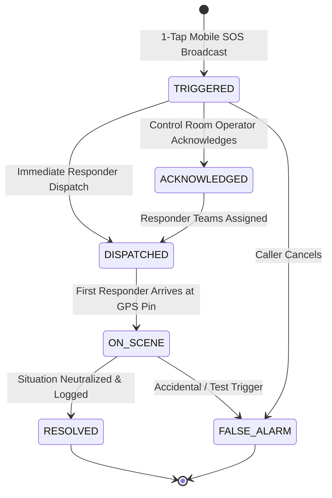
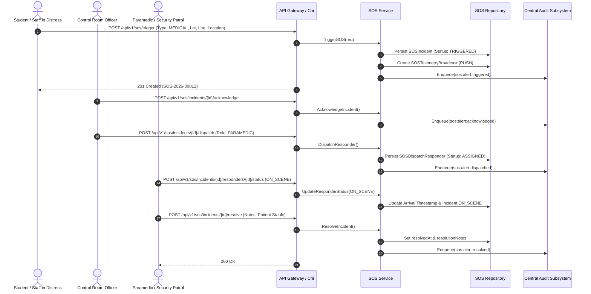

# Subsystem 14: SOS & Emergency Response (`sos`)

## 1. Overview & Business Context

The **SOS & Emergency Response System** provides instantaneous distress alert handling and telemetry dispatch for the campus community. Engineered for high reliability, it supports 1-tap emergency broadcasts from mobile devices with geographic coordinates, automated siren/push notifications, multi-role responder team dispatch, and comprehensive post-incident resolution audits.

Key architectural pillars:
- **Instantaneous 1-Tap Trigger:** Single-touch distress broadcast capturing live GPS coordinates with latitude/longitude bounds validation.
- **Deterministic Alert Identifiers:** Partitioned sequence numbering (`SOS-YYYY-NNNNN`) per tenant.
- **Multi-Role Responder Fleet:** Dispatch and track campus security patrols, ambulance/paramedic teams, hostel wardens, and fire safety officers.
- **Arrival Checkpoint Surveillance:** Live transition tracking (`ASSIGNED` -> `EN_ROUTE` -> `ON_SCENE` -> `COMPLETED`).
- **Resolution & False-Alarm Logging:** Mandatory resolution reports and post-incident compliance logging into the immutable audit ledger.

---

## 2. Emergency Incident State Machine

---

## 3. Telemetry Broadcast & Dispatch Sequence

---

## 4. REST API Transport Endpoints

| HTTP Method | Path | Description | Access Control |
| :--- | :--- | :--- | :--- |
| `POST` | `/api/v1/sos/trigger` | 1-Tap SOS Distress Trigger | Authenticated User |
| `GET` | `/api/v1/sos/incidents` | List & filter active/historical incidents | Security / Staff |
| `GET` | `/api/v1/sos/incidents/{id}` | Get incident telemetry & status | Requester / Staff |
| `POST` | `/api/v1/sos/incidents/{id}/acknowledge` | Acknowledge emergency alert | Control Room Operator |
| `POST` | `/api/v1/sos/incidents/{id}/dispatch` | Dispatch response units | Control Room Operator |
| `POST` | `/api/v1/sos/incidents/{id}/responders/{id}/status` | Update responder mission checkpoint (`EN_ROUTE`, `ON_SCENE`, `COMPLETED`) | Assigned Responder |
| `POST` | `/api/v1/sos/incidents/{id}/resolve` | Log resolution notes or false alarm | Responder / Operator |
| `GET` | `/api/v1/sos/incidents/{id}/responders` | List dispatched units for incident | Requester / Staff |

---

## 5. PostgreSQL 18 / Prisma 8 Data Models

- `SOSIncident`: Emergency alert entity with GPS coordinates, emergency type, status lifecycle, and resolution notes.
- `SOSDispatchResponder`: Responder missions mapping officers/paramedics to incidents with arrival timestamps.
- `SOSTelemetryBroadcast`: Multi-channel telemetry broadcasts (push notifications, SMS, public PA/sirens).
