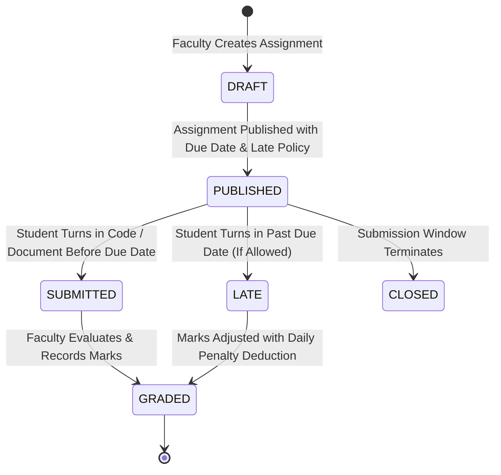
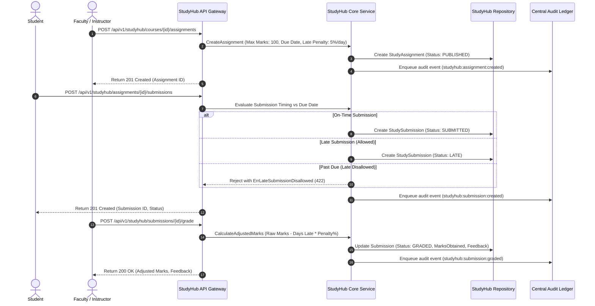

# Subsystem Specification: Study Hub & Assignment Management System (StudyHub)

**Subsystem Key:** `studyhub`  
**Rank:** 10 of 17 (Course Syllabus Structure, Lecture Notes & Study Materials, Assignment Submissions, Automated Late Penalty Grading, and Peer Reviews)  
**Status:** Implemented & Verified (100% Mock Unit & HTTP Integration Tests Passing)  

---

## 1. Domain Architecture & Assignment Submission Lifecycle

---

## 2. Invariants & Business Rules

1. **Submission Timing & Late Policy Invariant:**
   - Submissions made prior to or on the assignment `dueDate` receive the `SUBMITTED` status.
   - Submissions made past `dueDate` receive the `LATE` status if `allowLateSubmission` is enabled. If `allowLateSubmission` is false, submissions are strictly rejected with `ErrLateSubmissionDisallowed`.
2. **Deterministic Late Penalty Calculation:**
   - If an assignment is submitted late, the final marks are computed as:
     $$\text{AdjustedMarks} = \max\left(0, \text{RawMarks} - \left(\text{MaxMarks} \times \lceil\text{DaysLate}\rceil \times \frac{\text{LatePenaltyPercentPerDay}}{100}\right)\right)$$
3. **Marks Ceiling Invariant:**
   - Raw marks cannot be negative or exceed `maxMarks`. Violations fail with `ErrMarksExceedMaxMarks`.
4. **Peer Review Double-Blind & Self-Review Guards:**
   - Students cannot review their own submissions (`ErrSelfPeerReviewNotAllowed`).
   - Duplicate peer reviews on the same submission by the same reviewer are rejected with `ErrDuplicatePeerReview`.
   - Peer evaluation scores must fall within the range $0.0 \le \text{Score} \le 100.0$.
5. **Course Code Uniqueness & Normalization:**
   - Course codes (e.g., `CS-301`) are automatically normalized to uppercase and trimmed. Duplicate course codes within a tenant are rejected with `ErrCourseCodeExists`.

---

## 3. Implemented Components & File Mapping

| Layer | Component | Path | Invariant / Purpose |
| :--- | :--- | :--- | :--- |
| **Database** | Prisma 8 Relational Schema | `database/schema.prisma` | PostgreSQL 18 models for `StudyCourse`, `StudyMaterial`, `StudyAssignment`, `StudySubmission`, `StudyPeerReview`. |
| **Domain** | Domain Core & Invariants | `backend/studyhub/domain.go` | Entities, status machines, late penalty calculation, and score bounds evaluation. |
| **Domain** | Error Catalog | `backend/studyhub/errors.go` | Domain error sentinels and RFC 7807 problem details mapping. |
| **Domain** | Repository Contracts | `backend/studyhub/repository.go` | Interface contracts for courses, materials, assignments, submissions, and peer reviews. |
| **Domain** | Business Service | `backend/studyhub/service.go` | Course creation, study material publishing, assignment scheduling, grading calculations, and audit dispatching. |
| **Domain** | In-Memory Mock Repository | `backend/studyhub/mock_repository.go` | Thread-safe test doubles for all study hub entities. |
| **Domain** | Unit Test Suite | `backend/studyhub/studyhub_test.go` | 6 comprehensive unit tests covering course catalog, materials, on-time vs late submissions, penalties, and peer reviews. |
| **API** | HTTP Transport Handlers | `api/http/studyhub/handler.go` | REST endpoints with RFC 7807 problem details. |
| **API** | HTTP Transport Tests | `api/http/studyhub/handler_test.go` | HTTP integration tests for courses, materials, assignment submission, grading, and peer evaluation. |
| **Web Frontend** | TypeScript Types | `frontend/web/src/lib/types/studyhub.ts` | Frontend domain interfaces for courses, materials, assignments, submissions, and peer reviews. |
| **Web Frontend** | Course Material Desk | `frontend/web/src/lib/components/studyhub/CourseMaterialDesk.svelte` | Course syllabus viewer, unit-wise notes & lab manuals repository, and faculty publishing modal. |
| **Web Frontend** | Assignment Submission Desk | `frontend/web/src/lib/components/studyhub/AssignmentSubmissionDesk.svelte` | Student code submission desk, instructor grading matrix with auto late penalty preview, and feedback posting. |
| **Web Frontend** | StudyHub Route Page | `frontend/web/src/routes/studyhub/+page.svelte` | Unified Study Hub & assignments portal. |
| **Mobile Frontend** | Mobile StudyHub Screen | `frontend/mobile/app/(app)/studyhub.tsx` | Mobile course notes reader, assignment tracker, 1-tap submission upload, and peer review. |

---

## 4. REST API Endpoint Catalog

| HTTP Method | Route | Description | Success Code |
| :--- | :--- | :--- | :--- |
| `POST` | `/api/v1/studyhub/courses` | Create a new study course | `201 Created` |
| `GET` | `/api/v1/studyhub/courses` | List courses with department & semester filters | `200 OK` |
| `GET` | `/api/v1/studyhub/courses/{id}` | Get course details and syllabus | `200 OK` |
| `POST` | `/api/v1/studyhub/courses/{id}/materials` | Publish lecture notes / lab manuals | `201 Created` |
| `GET` | `/api/v1/studyhub/courses/{id}/materials` | List study materials by course and unit | `200 OK` |
| `POST` | `/api/v1/studyhub/courses/{id}/assignments` | Schedule course assignment with late policies | `201 Created` |
| `GET` | `/api/v1/studyhub/courses/{id}/assignments` | List assignments for a course | `200 OK` |
| `GET` | `/api/v1/studyhub/assignments/{id}` | Get assignment details | `200 OK` |
| `POST` | `/api/v1/studyhub/assignments/{id}/submissions` | Turn in assignment code archive | `201 Created` |
| `GET` | `/api/v1/studyhub/assignments/{id}/submissions` | List turned in submissions for grading | `200 OK` |
| `POST` | `/api/v1/studyhub/submissions/{id}/grade` | Grade submission & apply late penalties | `200 OK` |
| `POST` | `/api/v1/studyhub/submissions/{id}/reviews` | Submit double-blind peer review score | `201 Created` |
| `GET` | `/api/v1/studyhub/submissions/{id}/reviews` | List peer review scores for submission | `200 OK` |
