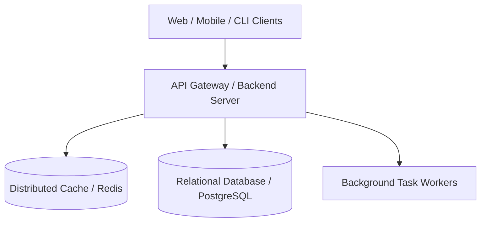

# System Architecture Specification

## 1. System Topology & Data Flow

---

## 2. Core Subsystems

| Subsystem | Responsibilities | Technology Stack |
| :--- | :--- | :--- |
| **API Gateway / Transport** | Authentication, rate limiting, routing, RFC 7807 problem details | Go / Node.js / Rust |
| **Domain Logic** | Business rules, state machines, algorithmic calculation | Pure typed domain modules (DI) |
| **Data Persistence** | Relational data, migrations, transactional consistency | PostgreSQL / SQLite |
| **Cache Layer** | Session state, query cache, pub/sub invalidation | Redis / In-Memory |

---

## 3. Key Invariants & Non-Functional Requirements

1. **Security:** Multi-tenant isolation at query level (`WHERE tenant_id = $1`).
2. **Performance:** Sub-50ms p95 latency for nominal read queries.
3. **Resilience:** Graceful error handling with structured problem details.
