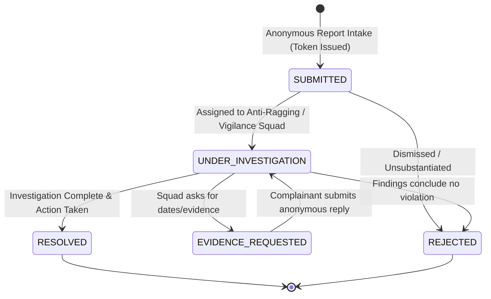
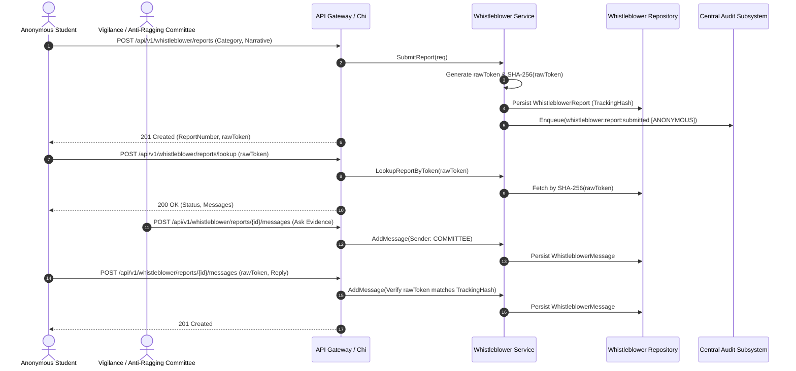

# Subsystem 15: Anonymity & Whistleblower System (`whistleblower`)

## 1. Overview & Business Context

The **Anonymity & Whistleblower System** delivers a secure, zero-knowledge grievance intake channel for the institution. Engineered to meet UGC anti-ragging mandates and institutional ethics oversight, it enables students and employees to submit reports on ragging, financial irregularities, academic corruption, and harassment with cryptographic anonymity.

Key architectural pillars:
- **Zero-Knowledge Token Architecture:** High-entropy secret token (`WB-tok-<hex>`) generated on submission; server stores only the SHA-256 hash `trackingHash`.
- **Decoupled Identity Guard:** Submissions are not tied to authenticated sessions, user profiles, or network IP identifiers.
- **Confidential 2-Way Channel:** Reporters can follow up, view status updates, and exchange encrypted dialogue with the committee using only their secret token.
- **Committee Investigation Workflow:** Structured state machine (`SUBMITTED` -> `UNDER_INVESTIGATION` -> `EVIDENCE_REQUESTED` -> `RESOLVED` / `REJECTED`).
- **Immutable Compliance Ledger:** All investigation events and disciplinary outcomes are audited anonymously without leaking complainant metadata.

---

## 2. Investigation State Machine

---

## 3. Cryptographic Token & Anonymous Dialogue Sequence

---

## 4. REST API Transport Endpoints

| HTTP Method | Path | Description | Access Control |
| :--- | :--- | :--- | :--- |
| `POST` | `/api/v1/whistleblower/reports` | Submit anonymous grievance & receive tracking token | Public / Anonymous |
| `POST` | `/api/v1/whistleblower/reports/lookup` | Lookup report status & dialogue using secret token | Public / Anonymous |
| `POST` | `/api/v1/whistleblower/reports/{id}/messages` | Post anonymous reply (Token) or committee message (Auth) | Reporter Token / Committee |
| `GET` | `/api/v1/whistleblower/committee/reports` | List & filter confidential reports | Authorized Committee |
| `POST` | `/api/v1/whistleblower/committee/reports/{id}/assign` | Assign report to vigilance squad | Committee Head |
| `POST` | `/api/v1/whistleblower/committee/reports/{id}/status` | Update investigation status & findings log | Assigned Investigator |

---

## 5. PostgreSQL 18 / Prisma 8 Data Models

- `WhistleblowerReport`: Confidential report entity storing SHA-256 tracking token hash, severity, and investigation findings.
- `WhistleblowerMessage`: Anonymous conversation thread items exchanged between complainant and committee.
- `WhistleblowerEvidence`: Attached documentary evidence with SHA-256 file integrity hashing.
